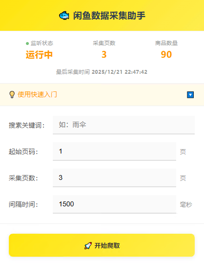
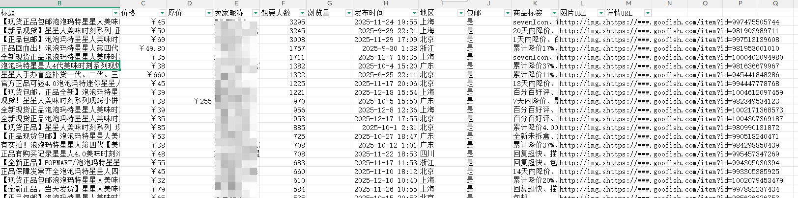

# 闲鱼数据采集助手

Chrome浏览器插件，快速采集闲鱼商品数据，精细化运营店铺。

## ✨ 功能规划

| 功能模块 | 当前状态 | 说明 |
|---------|---------|------|
| 关键词采集商品列表数据 | ✅ 已实现 | 输入关键词，自动爬取闲鱼商品数据 |
| CSV数据导出 | ✅ 已实现 | 一键导出采集数据为CSV文件 |
| 商品详情采集 | ⏳ 计划中 | 采集商品的浏览量、想要数据，卖家数据采集 |
| 飞书表格集成 | ⏳ 计划中 | 支持一键上传到飞书表格，实现精细化运营 |

## 🚀 快速开始

### 安装插件

1. 打开 Chrome 浏览器
2. 地址栏输入：`chrome://extensions/`
3. 开启右上角"开发者模式"
4. 点击"加载已解压的扩展程序"
5. 选择项目文件夹即可

### 使用步骤

1. 打开 https://www.goofish.com/ 并登录
2. 点击浏览器右上角插件图标
3. 输入搜索关键词（如：雨伞）
4. 设置采集页数（建议1-10页）
5. 点击"开始爬取"
6. 采集完成后点击"导出CSV"

## 📊 采集数据字段

| 字段名称 | 说明 |
|---------|------|
| 标题 | 商品标题 |
| 价格 | 当前售价 |
| 原价 | 商品原价 |
| 卖家昵称 | 卖家用户名 |
| 想要人数 | 想要该商品的人数 |
| 浏览量 | 商品浏览次数 |
| 发布时间 | 商品发布日期 |
| 地区 | 卖家所在地区 |
| 包邮 | 是否包邮 |
| 商品标签 | 商品相关标签 |
| 图片URL | 商品图片链接 |
| 详情URL | 商品详情页链接 |
- 

## ⚠️ 注意事项

- 请合理使用，遵守平台规则
- 建议采集间隔不少于1.5秒
- 数据仅供学习研究使用

## 版本信息

- 当前版本：v1.3.1
- 技术栈：JavaScript + Chrome Extension Manifest V3
