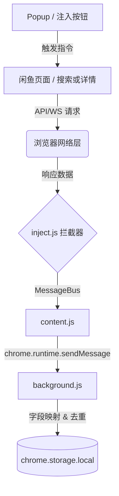
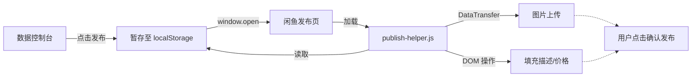

# 闲鱼数据采集助手

Chrome浏览器插件，快速采集闲鱼商品数据，精细化运营店铺。

## 1. 项目概述
`FishOps` 是一款专为闲鱼（Goofish）平台设计的 Chrome 浏览器插件。它旨在帮助用户快速采集商品数据、管理采集记录，并实现一键自动填充发布，极大提高了闲鱼店铺的运营效率。

## 2. 技术架构
项目采用 **Chrome Extension Manifest V3** 标准开发，主要由以下模块组成：

- **Background (Service Worker)**: `background.js` 负责全局状态管理、数据去重、持久化存储（storage）以及与外部 API（如飞书）的交互。
- **Content Scripts**: 
    - `content.js`: 运行在页面沙盒中，负责 DOM 操作和消息转发。
    - `inject.js`: 注入到页面真实上下文（MAIN world），负责拦截 API 请求和 WebSocket 消息。
- **API 模块**: `xianyu-api.js` 实现了闲鱼 MTOP 协议的签名算法（MD5 + Token），支持主动调用闲鱼搜索和详情接口。
- **UI 组件**:
    - `popup`: 插件弹窗，用于设置关键词和启动爬取。
    - `search-page-buttons.js`: 在搜索页注入“开始爬取”、“发送飞书”等按钮。
    - `item-download.js`: 在详情页注入下载按钮和管理控制台。
- **自动化逻辑**: `publish-helper.js` 负责在发布页面自动填充图片、描述和价格。

## 3. 数据流程
项目的数据流动遵循以下路径：

### A. 数据采集流 (Search/Detail)
1. **指令发起**: 用户通过 Popup 或页面注入按钮触发爬取。
2. **请求拦截**: `inject.js` Hook 了浏览器的 `fetch` 和 `XMLHttpRequest`，实时捕获闲鱼 API 的响应数据。
3. **消息中转**: 捕获的数据通过 `MessageBus` (window.postMessage) 从页面上下文传回 Content Script。
4. **清洗存储**: Background 接收数据，根据 `PRODUCT_SCHEMA` 进行字段映射、去重，并保存到 `chrome.storage.local`。

```mermaid
graph TD
    A[闲鱼页面 / 搜索或详情] -->|API/WS 请求| B(浏览器网络层)
    B -->|响应数据| C{inject.js 拦截器}
    C -->|MessageBus| D[content.js]
    D -->|chrome.runtime.sendMessage| E[background.js]
    E -->|字段映射 & 去重| F[(chrome.storage.local)]
    G[Popup / 注入按钮] -->|触发指令| A
```

### B. 自动化发布流
1. **数据准备**: 用户在采集控制台中点击“🚀 发布”。
2. **暂存跳转**: 插件将该商品数据存入 `localStorage` 的 `xianyu_pending_publish` 键，并打开闲鱼发布页。
3. **自动填充**: `publish-helper.js` 在发布页运行，读取暂存数据。
4. **模拟操作**: 通过 `DataTransfer` 模拟图片拖拽上传，并自动填写标题、描述和计算后的价格。

```mermaid
graph LR
    A[数据控制台] -->|点击发布| B[暂存至 localStorage]
    B -->|window.open| C[闲鱼发布页]
    C -->|加载| D[publish-helper.js]
    D -->|读取| B
    D -->|DataTransfer| E[图片上传]
    D -->|DOM 操作| F[填充描述/价格]
    E -.-> G[用户点击确认发布]
    F -.-> G
```

## 4. 核心功能
| 功能 | 说明 |
|------|------|
| **关键词采集** | 模拟翻页请求，批量提取搜索结果中的商品信息。 |
| **详情深度采集** | 获取商品浏览量、想要人数、卖家信用等深度数据。 |
| **一键自动发布** | 自动下载原图并上传至新发布页，填充文案，步进式日志显示进度。 |
| **飞书表格集成** | 支持手动发送或边爬边同步数据到飞书多维表格（Bitable）。 |
| **智能过滤** | 支持按价格区间、想要人数、包邮等条件自动筛选数据。 |

## 5. 使用教程
### 安装
1. 在 Chrome 中打开 `chrome://extensions/`。
2. 开启“开发者模式”。
3. 点击“加载已解压的扩展程序”，选择本项目根目录。

### 采集流程
1. **搜索采集**: 访问 `goofish.com` 搜索关键词，点击页面右上角或搜索框后的“开始爬取”。
2. **详情采集**: 进入具体商品页，点击右下角黄色“⬇️”按钮。
3. **数据管理**: 点击页面右下角黑色“📋”按钮打开控制台，查看或导出数据。

### 发布流程
1. 在控制台找到目标商品，点击“🚀 发布”。
2. 在自动打开的发布页面，等待插件完成图片上传和字段填充（右下角会有动态日志）。
3. 检查无误后，手动点击页面底部的“确认发布”。

## ⚖️ 开发准则 (Project Constitution)

本项目遵循严格的开发原则，所有贡献者及 AI Agent 必须遵循 [项目宪法](.gemini/constitution.md)：

- **极简主义**：零依赖优先，优先使用原生 Web API，确保性能最优。
- **安全性**：**严禁使用 innerHTML**，必须对数据进行消毒，严守 CSP。
- **职责分离**：Service Worker 保持无状态，明确各组件职责边界。
- **通信契约**：所有消息传递必须有明确定义的 Schema。

## 📄 版本与文档

- **当前版本**：v2.1.0
- **更新日志**：详见 [CHANGELOG.md](changelog.md)
- **技术栈**：JavaScript + Chrome Extension Manifest V3
- **更新日期**：2025-01

