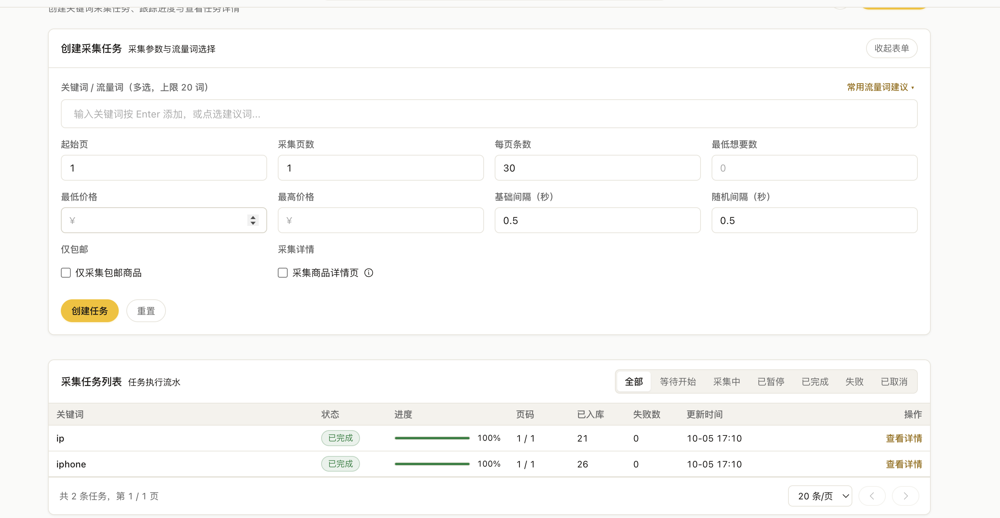
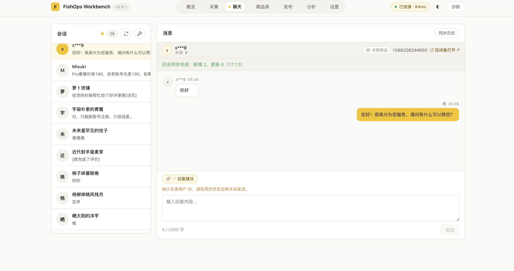
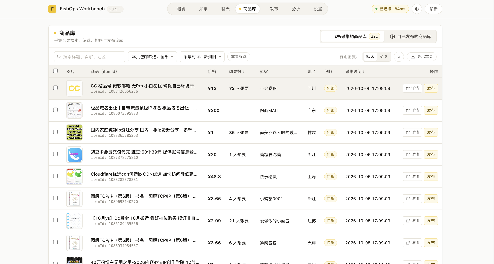
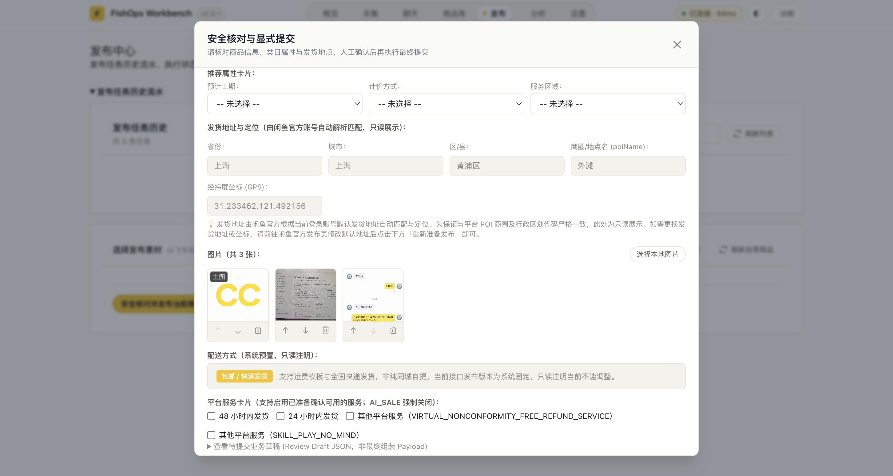

# FishOps Workbench

面向闲鱼（goofish）卖家的运营工作台：以 MV3 浏览器扩展承载运行时，用 Vue 3 工作台把数据采集、聊天回复建议、商品库、发布与数据分析串成一条流程。

## 安装与使用

支持 Chrome 和 Microsoft Edge，通过开发者模式加载插件。

1. 打开 [Releases](https://github.com/a1667834841/FishOps/releases)，选择需要的版本，在 **Assets** 中下载 `fishops-extension.zip`。
2. 将 ZIP 解压到一个固定目录。确认该目录内直接包含 `manifest.json`、`background.js` 和 `workbench.html`。安装时选择这个目录，保留解压后的文件。
3. 打开扩展管理页面：Chrome 输入 `chrome://extensions`，Edge 输入 `edge://extensions`。
4. 启用 **开发者模式**，点击 **加载已解压的扩展程序**（Edge 中为 **加载解压缩的扩展**），选择上一步包含 `manifest.json` 的目录。
5. 在同一浏览器中打开 [闲鱼网页版](https://www.goofish.com/) 并登录。如果安装前已打开闲鱼页面，请刷新页面。
6. 点击浏览器工具栏中的扩展按钮，找到 **FishOps Workbench**，点击插件图标打开工作台。可将插件固定到工具栏，方便下次打开。

如需使用 AI 或飞书相关功能，打开工作台的 **设置**，填写对应配置。

### 更新插件

下载新版本 ZIP，并将其解压后的文件替换到原安装目录。在扩展管理页面点击 FishOps Workbench 的 **重新加载** 按钮，然后刷新闲鱼页面并重新打开工作台。

### 暂无 Release 时

打开 [Actions](https://github.com/a1667834841/FishOps/actions)，选择「构建插件」的一次成功运行，在 **Artifacts** 中下载 `fishops-extension`。先解压下载的 Artifact，再解压其中的 `fishops-extension.zip`，然后按上述步骤加载。下载 Artifact 需要登录 GitHub。

构建与发布流程见 [CI 说明](docs/ci.md)。

## 背景介绍

二手电商运营常要在多个页面之间反复手工操作：搜同类商品、逐条记录价格与想要人数、盯聊天回复、整理商品、再逐个上架。这些动作重复、耗时，且数据散落在各处，难以沉淀和对比。

FishOps Workbench 把这些环节收进一个工作台：

- 运行时是 Chrome / Edge 的 MV3 扩展，在已登录的闲鱼网页会话内读取公开数据，不接管账号。
- 界面是 `chrome-extension://` 内的单页工作台，通过 Command / Event 协议调用扩展能力。
- 目标是减少机械劳动、让数据可复用；涉及发布、消息发送和 AI 输出的动作都保留人工确认。

## 功能展示

### 数据采集

按关键词创建采集任务，可设置起始页、采集页数、每页数量，并按价格与「想要人数」过滤；任务支持暂停与断点续采，采集结果可同步到飞书表。

*采集任务列表局部截图（历史 mock 验证示例）。*

### 聊天中心

同步会话与历史消息，支持按回复规则或 AI 生成回复建议；建议由用户确认后再发送。也可配置回复规则并手动暂停 AI 回复。

*示例截图：展示聊天中心空会话状态，不包含聊天正文；实际界面以当前版本为准。*

### 商品库
查看、筛选并导出已采集商品，支持飞书采集表与自营商品两类来源，可带入发布草稿。

### 发布中心

商品可从草稿进入填表和校验流程；提交前会要求用户确认，发布结果以官方在售商品数变化为判据。

*发布流程与素材选择（窄屏，历史验证截图，记录标识已脱敏）*

### 其他功能

- **数据分析**：选择本地或飞书数据源与提示词规则，生成结构化分析结果。
- **设置**：配置外观、AI 模型、飞书与回复策略等。

## 免责说明

- 本项目**非闲鱼官方**产品，与闲鱼及其关联方无任何关系。
- 仅供**学习研究**或**已获合法授权**的场景使用，使用者需自行确认用途合法合规。
- 使用时应遵守闲鱼平台规则及适用法律法规，并尊重**数据与隐私**边界。
- 发布、消息发送与 AI 生成内容均需**人工复核**后再执行，请勿依赖其自动化结果。
- 使用风险由使用者自行承担；本说明不构成法律意见，也不夸大免责效力。

## 技术原理

整体是「工作台 + 扩展运行时」两层：工作台（Vue 3 + Vite + TypeScript）运行在扩展内页，运行时（MV3 service worker + content scripts）负责与闲鱼页面通信，`shared/` 提供协议类型与运行时校验。闲鱼侧请求由一个注入 MAIN world 的平台 host 承载，在页面会话内完成 MTOP 调用与限速；采集、聊天、发布、分析各自作为独立模块构建在平台层之上。

安装构建、通信链路、平台调用、目录结构、构建产物与 Trace 排查等细节，见 **[技术原理文档](docs/technical-principles.md)**。

## 问题反馈与 Issue 规范

提交 bug、功能需求或任务前，先检索已有 issue 避免重复，并统一使用 **[Issue 规范](docs/issue-guidelines.md)** 的标题写法与章节格式。
