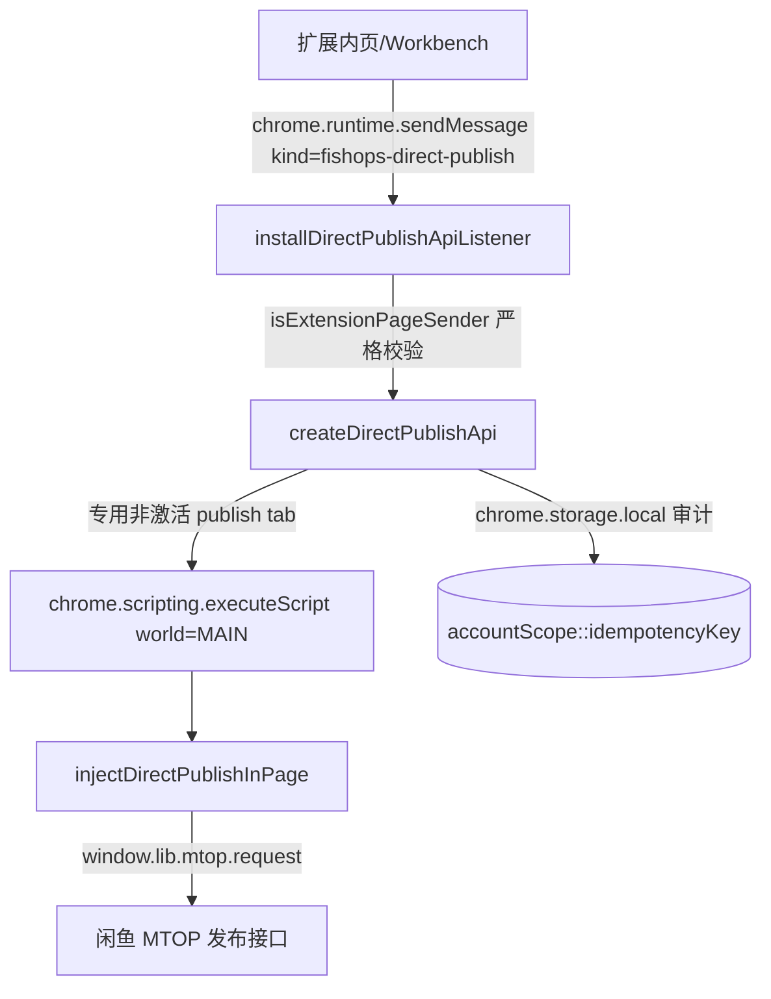

# 直接接口发布 API（Direct Publish API）

在扩展后台（service worker）内，**非 DOM 填表**地复用官方 MTOP SDK 直接调用闲鱼发布接口完成上架。
本模块把已验证的浏览器实验 harness 迁入 Workbench，并加上账号隔离、持久幂等审计与严格来源校验。

- 参考方案：`extensions/FishOps/docs/direct-publish-api-plan.md`
- 浏览器验证报告：`extensions/FishOps/docs/direct-publish-api-browser-report.md`（真实成功 item `1087978938358`）
- 参考 harness：`extensions/FishOps/docs/direct-publish-api-test.js`

> 边界：仅限本人账号、受控小流量实验；不承诺稳定全自动批量发布。所有风控命中一律转人工。

## 1. 新增文件（本次写集）

| 文件 | 作用 |
| --- | --- |
| `extension/src/background/direct-publish-page.ts` | MAIN world **完全自包含**的页面脚本 `injectDirectPublishInPage`，内部复用 `window.lib.mtop.request` 完成整条链路 |
| `extension/src/background/direct-publish-api.ts` | 后台 API `createDirectPublishApi` 与消息监听 `installDirectPublishApiListener` |
| `shared/types/direct-publish.ts` | **两阶段共享契约**（仅类型，不从 `shared/events/index.ts` 导出；前端按相对路径 `import type`） |
| `extension/src/publish/test/direct-publish-api.test.ts` | 一步式 publish 的纯 mock 单测 |
| `extension/src/publish/test/direct-publish-two-phase.test.ts` | **两阶段 prepare/submit 的纯 mock 单测**（含自动默认地址 / partial draft / 仅 confirm 提交等） |
| `extension/src/publish/test/direct-publish-session-recovery.test.ts` | **SW 休眠会话恢复回归**（storage.session 恢复 prepared / TTL / 重复提交分类 / fail-closed / 配额） |
| `extension/src/publish/test/direct-publish-page.test.ts` | MAIN world 页面脚本 vm 级单测（类目 / 服务卡 / preget 异常 / 自动默认地址 / partial draft） |
| `docs/direct-publish-api.md` | 本文档 |

未改动 `index.ts` / `shared` 索引 / `manifest.json` / 构建配置。安装接线由主代理负责（见第 3 节）。

> 两阶段（`prepare` + `submit`）是目前**推荐入口**；旧的一步式 `publish` 仍保留兼容，但新 UI 不应调用（见第 11 节）。

## 脱敏日志与滑块排查

- 官方运行页 Console：筛选 `[FishOps:DirectPublish:Page]`，记录请求开始、完成或失败，以及 `traceId / phase / api / code / status / actionRequired`。
- 扩展 Service Worker Console：在 `chrome://extensions/` 找到 FishOps，点击 Service Worker，筛选 `[FishOps:DirectPublish:Background]`，记录同一 `traceId` 的阶段结果、tabId、耗时和人工处理原因。
- `actionRequired: "captcha"` 表示接口明确返回验证码/风控错误；`TIMEOUT` 或 `PAGE_INJECTION_TIMEOUT` 只表示结果未知，不证明出现滑块。官方 SDK 可能等待验证后才返回，因此日志不保证在滑块弹出的瞬间产生。
- 不打印原始错误对象、错误正文、Cookie、token、用户 ID、商品正文、地址、图片 URL 或验证码 URL。错误码不符合受控格式时记录 `UNCLASSIFIED`。
- 日志仅覆盖本 API 发起的请求。用户手动打开商品详情页产生的滑块不会触发该 API 的日志。
- 构建后需重新加载扩展才能使用新日志；不会补录升级前的历史请求。

## 2. 架构



- 页面脚本只经官方 SDK 发请求：`type:POST / appKey:34839810 / accountSite:xianyu / dataType:json / timeout:20000`。
- 后台不接触 Cookie 明文；`unb` 只在页面内用于（a）派生不可逆 `accountScope`（SHA-256），（b）违禁词 `sessionId`。

## 3. 安装与所需 chrome 子集

主代理在 `extension/src/background/index.ts` **新增一行** 调用即可（函数幂等）：

```ts
import { installDirectPublishApiListener } from './direct-publish-api'
// ...
installDirectPublishApiListener()
```

- 监听使用**独立消息 kind** `'fishops-direct-publish'`，对其它消息返回 `false`，**不影响既有 Workbench 命令 / 订阅监听**。
- 只接受 `isExtensionPageSender` 判定的扩展内页来源（`chrome-extension://<本扩展 ID>/...`），拒绝 content script 与外部页面。

依赖的 chrome 子集（真实接线时从全局 `chrome` 取；测试可注入 mock）：

| 能力 | 用途 |
| --- | --- |
| `chrome.tabs.query / create / get`（`onRemoved` 可选） | 维护**专用非激活发布 tab**（`active:false`） |
| `chrome.scripting.executeScript` | `world:'MAIN'` 注入自包含页面脚本 |
| `chrome.storage.local.get / set` | 持久幂等审计账本（**落盘**，仅脱敏结构；**绝不存个人地址 / 正文**） |
| `chrome.storage.session.get / set`（可选） | 两阶段 prepared 条目（**会话内存、非落盘**，SW 休眠不丢，浏览器重启 / 扩展重载清空） |
| `chrome.runtime.onMessage` + `chrome.runtime.id` | 安装监听与来源校验 |

`storage.session` 缺失时（旧 mock / 无该能力）自动退化为旧的内存缓存，行为与修复前一致。真实接线会显式调用
`storage.session.setAccessLevel({ accessLevel: 'TRUSTED_CONTEXTS' })`（默认值，后台 + 扩展内页），**绝不**扩到 content script。

无需新增 manifest 权限（`scripting` / `tabs` / `storage` 已在 `extension/public/manifest.json` 中）。

## 4. 调用格式

### 4.1 后台直接调用

```ts
import { createDirectPublishApi } from './background/direct-publish-api'

const api = createDirectPublishApi({
  chrome: {
    tabs: chrome.tabs as never,
    scripting: chrome.scripting as never,
    storage: { local: chrome.storage.local as never },
  },
})

const result = await api.publish({
  source: { itemId: '1087978938358', imageIndexes: [0, 2] },
  idempotencyKey: 'pub-2026-0001',
  confirm: true,
  seller: {
    // 二选一：
    // address: { prov, city, area, divisionId, poiName, poiId, gps },
    coordinates: { latitude: 30.1, longitude: 120.2 },
  },
  servicePreferences: {}, // 默认全部 false；AI_SALE 强制 false
  confirmedNoQrCodes: true,
})
```

第二种入口（用 `product` 直接给商品，价格为「元」字符串）：

```ts
await api.publish({
  source: {
    product: {
      description: '手写商品描述',
      price: '35000',
      images: ['https://img.example.com/a.jpg'],
      specifications: [{ name: '尺码', value: 'M' }], // 可选，singleSKU 融入描述
    },
  },
  idempotencyKey: 'pub-2026-0002',
  confirm: true,
  seller: { coordinates: { latitude: 30.1, longitude: 120.2 } },
  confirmedNoQrCodes: true,
})
```

只读读取源商品（供第二种入口预填，最小字段，不含卖家私密信息）：

```ts
const detail = await api.getProduct('1087978938358')
// detail.product = { description, price, images, specifications }
```

审计查询（只读）：

```ts
await api.getJob('pub-2026-0001') // 指定 key；缺省返回最近 50 条
```

### 4.2 扩展内页消息（供第二种测试入口）

```ts
// publish
chrome.runtime.sendMessage({
  kind: 'fishops-direct-publish',
  method: 'publish',
  request: { /* DirectPublishInput，同上 */ },
})
// -> { kind, method: 'publish', ok, result: DirectPublishResult }

// getProduct
chrome.runtime.sendMessage({
  kind: 'fishops-direct-publish',
  method: 'getProduct',
  request: { itemId: '1087978938358' },
})
// -> { kind, method: 'getProduct', ok, result: DirectProductResult }
```

长请求直接以 Promise **保持消息通道**（监听器返回 `true`，完成后再 `sendResponse`），不阻塞扩展启动。

### 4.3 返回结果

```ts
type DirectPublishOutcome = 'published' | 'action_required' | 'rejected' | 'unknown'

interface DirectPublishResult {
  status: DirectPublishOutcome
  idempotencyKey: string
  itemId?: string                        // 只有 published 才有
  actionRequired?: 'login' | 'captcha' | 'verification'
  code?: string
  message?: string
  reused?: boolean                       // 同 key 命中既有成功结果，未再次请求
  fingerprint?: string                   // 输入 SHA-256
  warnings?: string[]
}
```

- `published`：**唯一成功判据**是 `mtop.idle.pc.idleitem.publish` 返回 `data.itemId` 存在。
- `action_required`：`login` / `captcha` / `verification`（实人认证、发布受限二维码）。
- `rejected`：业务拒绝（违禁词、类目不支持、非法输入、同 key 冲突等）。
- `unknown`：结果未知（超时、网络异常、SUCCESS 无 itemId、审计不可用）。**禁止重试，无任何自动 retry。**

## 5. 页面脚本链路（prepare 依次执行）

`injectDirectPublishInPage` 分四个 `op`：`account` / `prepare` / `publish` / `getProduct`。

`prepare` 依次：`detail`（itemId 源，`mtop.taobao.idle.pc.detail`，`itemDO.soldPrice` 单位为**元**）
→ `prepublish.check`（受限即 `action_required/verification`）
→ `preget` → 图片下载/上传 → `badwords.prepubcheck`（`forbidPublish:true` 阻断）
→ `property.recommend`（完整 imageDO）→ `poi.get`（地址）→ `service.cards.list` → 组装 payload。

`publish` 阶段：再次 `prepublish.check` → `mtop.idle.pc.idleitem.publish`
（`sourceId/bizcode/publishScene` 均为 `pcMainPublish`，`uniqueCode` 现场生成）。

从真实响应修正并落实的关键点：

1. POI 地点名为 `poi`，坐标为 `latitude/longitude`；映射为 `poiName=poi`、`gps=lat,lng`。
2. 推荐返回 `cardList[].cardData.valuesList`（嵌套），`catId` 与 `channelCatId` 是不同字段；保留 `transportData`，不从展示文本造 ID。
3. 服务卡 `itemInfoJson` 需完整商品结构（含 `itemTextDTO`）；`cpvList` 传原始 `cardList`。
4. 违禁词看 `forbidPublish`，`result:false` 不代表禁止。
5. HTTP 图片仅对**已知媒体主机**升级为 HTTPS，其它非 HTTPS 主机直接拒绝（防 Mixed-Content / SSRF）。
6. 上传：XHR + `FormData` 字段 `file`、`withCredentials:true`、`maxCount 9`、单张 ≤ 10MB；尺寸不猜，取不到即失败。
7. 明确仅支持网页端发布的分类卡 `cardType === '20401'` 且非图书，否则 `rejected/UNSUPPORTED_CATEGORY`。
8. 只做 singleSKU：`multiSKU:false`，规格融入描述，**不虚构多 SKU**。
9. 所有服务卡默认 `false`；`AI_SALE` 强制 `false`。
10. **账号防漂移**：后台探测到的 `accountScope` 会作为 `expectedAccountScope` 传入 prepare / publish；各阶段开始与最终 `mtop publish` 前都对 `sha256(unb)` 复核，不一致返回 `action_required/ACCOUNT_CHANGED` 并阻断，绝不换账号提交。
11. 失败分类**统一**：任意阶段（detail / prepublish / preget / poi / badwords / recommend / service cards / publish / getProduct）的 MTOP 失败都归一到 `login / captcha / verification / rejected / unknown`，不再只在 publish 阶段识别风控。

## 6. 幂等、审计与并发

- **账号隔离**：审计账本存 `chrome.storage.local`，键为 `accountScope::idempotencyKey`（`accountScope` 由页面返回的 `unb` 哈希，不可逆）。
- **指纹**：`sha256(stableStringify({ source, seller, servicePreferences, confirmedNoQrCodes }))`（WebCrypto）。同 key 不同 input → `rejected/IDEMPOTENCY_KEY_CONFLICT`。
- **顺序**：账号探测 → 读账本 → `prepare` → **先写 `attempting`** → 提交 → 写最终态。
- **成功同 key**：直接返回既有 `itemId`（`reused:true`），不再发任何请求。
- **严格拒重**：`attempting` / `unknown` 状态的同 key 一律阻断（`PREVIOUS_ATTEMPT_UNKNOWN`）；`action_required` / `rejected` 允许修正后重试。
- **service worker 重启**：账本持久，残留 `attempting` 会阻断同 key 再发布。
- **fail-closed**：审计存储读 / 写失败时返回 `unknown/AUDIT_STORAGE_UNAVAILABLE`，**绝不提交**。
- **账本完整性**：仅当存储键不存在时才初始化空账本；键存在但根节点 / `version` / `entries` / 单项关键字段（`accountScope`/`idempotencyKey`/`fingerprint`/`status`/`at`）损坏时一律 **throw 并 fail-closed**，绝不静默降级为空账本（防伪造清账导致重复铺货）。
- **账号漂移**：`prepare` 成功会回传 `accountScope`，后台与探测值不一致则不写 `attempting`，直接 `action_required/ACCOUNT_CHANGED`。
- **全局锁**：`publish` 调用前同步加锁，并发触发返回 `rejected/CONCURRENT_LOCK`。

## 7. 专用发布 tab

- 自动创建 / 复用 **专用非激活 tab**：`https://www.goofish.com/publish?fishopsDirectPublish=1`（`active:false`，不抢焦点）。
- **严格 URL 校验**（不用 substring）：必须 `https:` + 主机恰为 `www.goofish.com` + pathname 恰为 `/publish` + 查询参数 `fishopsDirectPublish === '1'`。相似 / 恶意 URL（如 `https://www.goofish.com.evil.com/...`、`?fishopsDirectPublish=10`、`http://...`）一律不复用，**绝不接管用户已打开的 tab**；自定义 `publishUrl` 同样校验，非法则 `TAB_UNAVAILABLE` 且不注入。
- 等待加载完成有界（默认 15s），不无限等待。
- 只做内部会话与 SDK 调用，**不操作 DOM**。

## 8. 安全、超时与脱敏

- 不输出、不落盘 Cookie / token / 明文 `unb`；`unb` 仅用于身份哈希与违禁词 `sessionId`。
- 接口错误 / 日志脱敏（单行截断、不含凭据与完整地址明文）。
- 页面 payload 仅在内存中经 `executeScript args` 传递，不写入审计账本。
- **图片下载有界**：`AbortController` + 30s 超时，`finally` 必定清定时器，避免悬挂请求；图片解码（`Image`）另有有界超时，超时归“取不到尺寸”而非猜尺寸。
- **后台注入有界**：`executeScript` 外层带注入超时（默认 120s，`injectTimeoutMs` 可配），超时归 `unknown/PAGE_INJECTION_TIMEOUT` 并**不重试**；需注意超时可能已产生上传等副作用（页面侧 fetch 已在 30s 内自我收敛）。
- **SDK 内部可能重放**：官方 SDK 对 `FAIL_SYS_ILLEGAL_ACCESS` 可能内部重放一次 token / 请求序列，属于 SDK 自身行为；本模块**从不**自行重试业务提交。

## 9. 测试

```sh
# 定向测试
cd extension
node --import ./src/background/__tests__/register.mjs --test src/publish/test/direct-publish-api.test.ts

# 或经 npm
npm run test:publish --workspace @fishops/extension
```

覆盖：来源（itemId / product）、幂等（同 key 复用 / 同 key 不同 input 冲突 / unknown 拒重）、service worker 重启阻断、损坏 ledger fail-closed、严格 tab（相似 / 恶意 URL 不复用、自定义 publishUrl 校验）、账号漂移、入参 schema（价格 / 规格）、注入超时、可信来源（拒绝 content script / 外部 id）、发布响应四态归一、并发锁、监听器协议。

两阶段专项（`direct-publish-two-phase.test.ts`）另覆盖：
prepare 不 publish/submit 且不写审计、修改后的 draft 真正传入、缺 confirm/token 拒绝、
未知 token（SW 重启）`PREPARE_EXPIRED`、重复提交阻断、未知锁定 `PREVIOUS_ATTEMPT_UNKNOWN`、
幂等复用 `reused`、账号漂移 `ACCOUNT_CHANGED`、恶意 draft（非候选类目/属性、伪造图片、未知服务）拒绝、
token 过期、文案更新违禁词复检拒绝、并发提交锁、监听器 prepare/submit 的 ok 语义。

SW 休眠恢复专项（`direct-publish-session-recovery.test.ts`）另覆盖：prepared 落 `chrome.storage.session` 后
重启仍可 submit（H1 主 bug）、25 分钟内可恢复 / 超过 TTL 报 `PREPARE_EXPIRED`（H2）、同 token 二次提交报
`SUBMIT_DUPLICATE`（H3）、未知 token 报 `PREPARE_NOT_FOUND`、session 写失败 / 结构损坏 / 条目缺关键数据一律
fail-closed `PREPARE_STORAGE_UNAVAILABLE`（绝不使用前端伪造 candidate）、prepared 只落 session 而 `storage.local`
不含个人地址 / 正文、prepared 会话条目上限 50、真实接线透传 session 并限定双 `TRUSTED_CONTEXTS`。
**全部使用 mock chrome，不触网、不创建真实 tab、不实际发布。**

业务拒绝恢复专项（`direct-publish-business-reject.test.ts`）另覆盖：页面层 vm 真实 `opSubmit` / `opPublish` 对 SDK reject
`ret:['FAIL_BIZ_TITLE_LENGTH_TOO_LONG::…']`、受控 `[FAIL_BIZ_*]` 文案、结构化 `FAIL_BIZ_` code 一律归 `rejected`；
真正 timeout / network 与仅含 business 字样的自由文案保持 `unknown`；后台「业务拒绝 → 后台新实例 + 改稿同 token → published」
且**不重复 prepare / 上传**、unknown 不恢复（`SUBMIT_DUPLICATE`）、连续拒绝可反复改稿、审计写失败不恢复
（`REJECT_RESTORE_UNAVAILABLE`）、**最终描述（含规格拼接）长度预检**在 consume 前拒绝（旧独立标题 30 字限制已随描述模式移除）。**同样全部使用 mock / vm 隔离上下文，不触网、不创建真实 tab、不实际发布。**

真实两入口已成功验证（不再新建商品）：

- itemId 入口：新 item `1087983250245`；
- product 入口：新 item `1090104128936`。

## 10. 风险与已知不准确（必读）

以下为真实运行中暴露的风险，**不可作为精准配置的承诺**：

- **自动推荐不可信（DGX 场景）**：真实 DGX 商品的自动 `recommend` 曾把显存识别为 **8–16GB**、把型号识别为 **Quadro**，与实际配置不符。因此返回的 `warnings` **必须包含**“推荐类目与属性由接口自动识别，需人工核对，不保证精准配置”；不得用自动推荐结果对外宣称/交付“精准配置”。
- **规格仅追加描述**：`source.product.specifications` 只以文本追加到 `itemTextDTO.desc`（singleSKU），**不代表平台属性/标签已校验通过**；prepare 会附带相应 warning。
- **发布后不得改数据**：真实发布成功后**不再修改已发布商品数据**；本模块不提供任何编辑 / 删改已发布 item 的能力。
- 未做删字段式必填契约验证；字段契约为「观察到」而非服务端最小必填。
- 不支持多规格 / 多 SKU、图书类目、批量发布。
- 不做验证码 / 实人认证绕过，不做 SDK token 重放；账号漂移一律阻断。
- 审计为单扩展实例内持久账本，不是跨设备分布式幂等；账本损坏 fail-closed（拒绝发布）。

## 11. 两阶段：prepare / submit（推荐入口）

一次发布拆成两段：`prepare` 跑完最终 `publish` 之前的**全部接口**并返回「完整已准备、实际待发送数据」，
人工审核后再用 `submit` 提交。两段都走**同一消息 kind** `fishops-direct-publish`（`method: 'prepare' | 'submit'`）。

```ts
// 1) 准备（不提交）
const prepared = await api.prepare({
  source: { itemId: '1087978938358', imageIndexes: [0, 2] },
  // 或 source: { product: { description, price, images, specifications? } }
  //   （闲鱼商品无独立标题；旧 title? 字段已被忽略，不再与描述合并）
  idempotencyKey: 'pub-2026-0001',
  // seller 可选：缺省时后台自动取当前账号官方默认发货地址（只读 POI，不使用源卖家地址）；
  // 显式传入时作为 override 继续兼容：
  //   seller: { address: { prov, city, area, divisionId, poiName, poiId, gps } }
  // 或 seller: { coordinates: { latitude: 30.1, longitude: 120.2 } }
  // category / attributes 可选：按候选校验后作为初始选择，绝不被推荐结果覆盖
})
// prepared.status === 'prepared' → 拿到 prepareToken / draft / propertyCards
// 失败时可能返回 partial draft + failureStage + missingFields（无 token，仅供 UI 展示）

// 2) 人工审核后最终提交（唯一门禁：confirm === true）
const result = await api.submit({
  prepareToken: prepared.prepareToken!,
  draft: prepared.draft!,   // 可在白名单字段内编辑
  confirm: true,
})
// result.status === 'published' 且 result.itemId 存在才算成功
```

### 11.1 prepare 做什么

`prepare` 依次执行：账号探测 → `prepublish.check`（资格/实人）→ `preget`（只读能力；**不提供发货地址**）
→ 详情（itemId 源）→ 违禁词（**仅对最终待发送描述**，含规格追加；描述模式无独立标题）→ 图片下载/上传（两阶段**自动上传**，不再要求 `confirmedNoQrCodes`）
→ `property.recommend`（推荐类目/属性，返回候选）→ 发货地址 → `service.cards.list`。

发货地址解析顺序：显式 `seller.address`（白名单 + gps 数值范围校验）→ 显式 `seller.coordinates`（`poi.get`）→
**两阶段缺省时** `mtop.taobao.idle.local.poi.get` **空参只读当前账号官方已选默认地址 `selectedPoi`**，
归一化 `poiName ← poi`、`gps ← latitude,longitude`；**只接受 `selectedPoi`**，绝不回退 `commonAddresses` / `nearbyAddresses`（那不是账号已选地点），
也不继承源卖家地址。`selectedPoi` 缺失时返回 `rejected/DEFAULT_ADDRESS_NOT_SELECTED` 并保留 partial draft，引导用户在官方发布页选择地址。

返回：

| 字段 | 说明 |
| --- | --- |
| `prepareToken` | 不可伪造的随机 token；**权威 prepared 条目存于 `chrome.storage.session`**（会话内存、非落盘），submit 时据此取回本轮准备数据 |
| `draft` | 完整「实际待发送数据」（见 11.2）：description（**原始文本，未追加规格**，唯一文案）/ price / specifications / category / attributes / address / images / services；`title` 为 **deprecated 可选**兼容字段（无独立标题） |
| `propertyCards` | 类目 / 属性**候选卡**（供人工资讯与选择），含每个候选的权威 `transportData` |
| `warnings` | 脱敏告警（含「推荐类目与属性需人工核对」） |

> `prepare` **绝不**调用 `publish`；也**不写审计**（避免把 `unknown` 写进账本导致后续 submit 被误拒）。

> **失败阶段细分与 partial draft**：失败时返回 `failureStage`（`source/login/network/parse/address/category/images/badwords/services/verification` 等）
> 与 `missingFields`（缺失字段），并保留**到当前点为止的 partial draft**（含已上传图片、已取得的 `propertyCards`）、
> 无效的 `address` 字段也原样保留在 partial 中便于定位；**登录 / 风控同样带阶段**，不返回空白技术表单。
> **只有完整准备成功才返回 `prepareToken`**，因此失败不可 submit。
> `preget` 异常不会被吞掉：会作为 `warnings` 保留（登录 / 风控类仍结构化中断）；`preget` 响应**不含地址**（已只读核实）。

> **已有 category / attributes（可选）**：若请求携带 `category` / `attributes`，会按本轮推荐候选逐项校验后
> 作为**初始选择保留并原样返回**（绝不被推荐结果覆盖）；非法候选拒绝（`CATEGORY_INVALID` / `ATTRIBUTE_INVALID`）。
> 注意：当前 **UI 暂不支持传入 existing**（不提供“带入已有值再准备”入口），该参数仅供后续 UI 接入；
> 本轮不新增未经真实验证的类目 API。

### 11.2 审核草稿 `draft`（共享契约）

`shared/types/direct-publish.ts` 定义并经 `DirectPublishReviewDraft` 固定：

```ts
interface DirectPublishReviewDraft {
  title?: string                                       // @deprecated 无独立标题：旧 title 被忽略（不校验 / 不拼接 / 不参与指纹）
  description: string                                  // 唯一文案：原始文本，不含规格追加（规格只追加一次）
  price: string
  specifications: Array<{ name: string; value: string }>
  category: Record<string, string>                     // 须为候选之一，如 { catId, catName, channelCatId, leafId, tbCatId }
  attributes: Array<Record<string, unknown>>           // 须命中 propertyCards 候选值
  address: Record<string, string>
  images: Array<Record<string, unknown>>               // 只能从已上传图片中重排 / 删除
  services: Array<{ serviceCode: string; enable: boolean }>
}
```

> **无独立标题**：闲鱼商品只有描述。`submit` 归一化时**忽略** `title`（旧字段），以 description 填充内部兼容字段，
> 避免「同描述不同隐形 title」产生指纹冲突；最终 `itemTextDTO` 的 `title` 与 `desc` 同为最终描述（`titleDescSeparate=false`）。

`propertyCards` 的元素形状（前端渲染候选用）：

```ts
{
  cardType: string, propertyId: string, propertyName: string,
  isCategory: boolean, isBook: boolean, supportWebPublish: boolean, tips: string,
  values: Array<{
    valueId: string, valueName: string,
    transportData: Record<string, unknown>,   // 权威候选值，后台凭此重建 label item
    isCategory: boolean,
    catId?: string, channelCatId?: string, catName?: string, leafId?: string, tbCatId?: string,
  }>
}
```

> `category` 中的 `catId`/`channelCatId`/`valueId` 任一命中候选即可；`attributes` 中的每项按 `propertyId + valueId`
> 命中候选（类目 label 由后台统一重建，可在 `attributes` 里保留但会被忽略）。**前端可传入选择，但后台只接受已准备候选，绝不接受任意 ID / 任意 transportData**。

### 11.3 submit 做什么（安全边界）

`submit` 先做**严格运行时校验**（见 11.4），再用**已准备候选**重建最终 payload，然后：

1. 重新探测账号，与 prepare 的 `accountScope` 比对，**账号漂移一律 `action_required/ACCOUNT_CHANGED`**；
2. 读审计账本（fail-closed），按 `accountScope::idempotencyKey` 判重：已成功直接 `reused`；`attempting`/`unknown` 一律 `PREVIOUS_ATTEMPT_UNKNOWN` 阻断；
3. **先写 `attempting`**，再消耗 token，然后注入页面 `submit`；
4. 页面内**再次** `prepublish.check` → 对修改后的文案**重新违禁词复检** → **重新 service cards 校验**
   （cpvList 已按**最终确认选择**从原始推荐卡克隆并更新 `isClicked`，绝不传旧推荐状态；
   已开启但复检后不可用的服务 → `rejected/SERVICE_UNAVAILABLE`，绝不静默删除或自动改变用户已确认数据；
   **不自动追加**复检新出现但用户未确认的服务；`AI_SALE` 强制 `false`）→ 最终 `mtop.idle.pc.idleitem.publish`；
5. 成功判据仍为返回 `data.itemId` 存在；服务端**明确业务拒绝**（`FAIL_BIZ_*`，如违禁内容 / 类目等）归 `rejected`（可改稿重提），仅 timeout / 网络异常归 `unknown`（**禁止自动重试**），真正未知结果不返回 `itemId` 时同样 `unknown`。
   （旧独立标题模式的 30 字限制 `FAIL_BIZ_TITLE_LENGTH_TOO_LONG` 已随描述模式（`titleDescSeparate=false`）不再触发；页面仍按通用 `FAIL_BIZ_*` 分类归 `rejected`。）

页面侧组装时：`itemTextDTO = { desc: 最终描述, title: 最终描述, titleDescSeparate: false }`（最终描述 = 描述 + 规格，**只追加一次**）。
**描述模式无独立标题**：`title` 与 `desc` 同为最终描述，不再触发旧服务端 30 字独立标题限制（`titleDescSeparate=true` 已弃用）。
service cards 中间 `itemInfoJson` 与最终 publish payload 使用**同一**描述模式 DTO。

### 11.4 白名单校验（拒绝任意拼接 / 未知字段注入）

| 字段 | 校验 |
| --- | --- |
| `description` | 必填；按「描述 + 规格追加**只一次**」的**最终描述**长度校验，≤5000 字；**无独立标题**，旧 `title` 字段被忽略（不校验 / 不拼接 / 不参与指纹） |
| `price` | 元字符串，最多 2 位小数、**有限数值**且 > 0（防极长 / `Infinity` 绕过 `Number <= 0`） |
| `specifications` | 每项非空 `name`/`value`；追加到描述**只一次** |
| `category` | 必须命中本轮 `propertyCards` 的**网页支持候选**，否则 `DRAFT_CATEGORY_INVALID` |
| `attributes` | 每项按 `propertyId+valueId` 命中候选，用**候选的 `transportData`** 重建；否则 `DRAFT_ATTRIBUTE_INVALID` |
| `address` | 只保留 `prov/city/area/divisionId/poiName/poiId/gps` 白名单，缺一即拒；`gps` 需为 `lat,lng` 数值且经纬度在合法范围内（防止只改 GPS 与 poiId 不一致却静默通过） |
| `images` | 只允许已上传图片的**重排 / 删除**（按 `url` 命中缓存），**禁止伪造上传图片数据**；1–9 张 |
| `services` | 只允许本轮已确认可用的服务；未知服务 `DRAFT_SERVICE_INVALID`；`AI_SALE` 强制 `false`。提交前复检时，**已开启但复检不可用 → `SERVICE_UNAVAILABLE`**；不自动追加新服务、不静默改写开关 |

未知顶层 / 属性字段被忽略，不会进入最终 payload。

### 11.5 结果

`prepare`（`DirectPublishPreparedResult`）与 `submit`（`DirectPublishSubmitResult`）都把状态归一到
`prepared`（仅 prepare）/ `published` / `action_required` / `rejected` / `unknown`。
监听器 `ok` 语义：**prepare 看 `status === 'prepared'`；submit 看 `status === 'published'`**。

| 场景 | 结果 |
| --- | --- |
| token 已过期（超过 TTL，含重启后） | `rejected/PREPARE_EXPIRED`（需重新 prepare） |
| token 从未准备 / 会话已清空（如浏览器重启、扩展重载） | `rejected/PREPARE_NOT_FOUND`（需重新 prepare） |
| 同 token 二次提交（token 已消耗） | `rejected/SUBMIT_DUPLICATE`（无需重试） |
| prepared 会话存储不可读 / 结构损坏 / 写入失败 | `unknown/PREPARE_STORAGE_UNAVAILABLE`（fail-closed） |
| 同 `idempotencyKey` 不同准备输入 | `rejected/IDEMPOTENCY_KEY_CONFLICT`（prepare） |
| 同 `idempotencyKey` 不同最终 payload | `rejected/IDEMPOTENCY_KEY_CONFLICT`（submit） |
| 同 key 曾 `unknown` / `attempting` | `unknown/PREVIOUS_ATTEMPT_UNKNOWN` |
| 同 key 已成功 | `published` + `reused: true`（未再次请求） |
| 账号漂移 | `action_required/ACCOUNT_CHANGED` |
| 已开启服务在提交前复查时不可用 | `rejected/SERVICE_UNAVAILABLE`（不 publish、不静默修改） |
| 账号未选择默认地址（`selectedPoi` 为空） | `rejected/DEFAULT_ADDRESS_NOT_SELECTED`（不偷用 common/nearby，保留 partial draft 引导用户在官方页选地址） |
| prepare 缺地址 / 类目 / 服务卡异常等 | `rejected|unknown` + `failureStage` + `missingFields` + partial `draft`，**无 `prepareToken`** |
| 最终 publish 被服务端**明确业务拒绝**（`FAIL_BIZ_*`，如违禁内容 / 类目等；旧独立标题 30 字限制已随描述模式移除） | `rejected/<FAIL_BIZ_*>` + `retryable:true` + `prepareTokenValid:true`，**恢复同 token、清 `consumed`**，可改稿后手动重提；真正 timeout / 网络异常仍 `unknown`（`PUBLISH_TIMEOUT` / `PUBLISH_NETWORK_UNKNOWN`，禁止自动重试） |
| 业务拒绝但 `rejected` 审计未持久化 / 恢复 token 失败 | `unknown/REJECT_RESTORE_UNAVAILABLE` + `prepareTokenValid:false`（fail-closed，绝不假装可重试） |

**业务拒绝恢复**：页面层对最终 `mtop.idle.pc.idleitem.publish` 的 reject 先做结构化分类——SDK reject 带 `ret:['FAIL_BIZ_*::msg']`、或受控 `[FAIL_BIZ_*]` 文案、或结构化 `code` 前缀 `FAIL_BIZ_`，一律归 `rejected`（不再一律 `PUBLISH_NETWORK_UNKNOWN`）；其余保持 `unknown`。后台在**审计已持久化 `rejected` 之后**，才把已 consume 的 token 恢复到 `storage.session`（清 `consumed`、沿用原权威候选与已上传图，**不重复 prepare / 上传**），因此可改稿后用**同一 token** 手动重提。`unknown`/`attempting`/`published` 与审计写失败场景**绝不恢复**。已知 `rejected` 允许同 `idempotencyKey` 换新指纹（改稿）重试；其余状态换指纹仍 `IDEMPOTENCY_KEY_CONFLICT` / `PREVIOUS_ATTEMPT_UNKNOWN`，不能绕锁。

> `submit` **唯一必需门禁为 `confirm: true`**；旧的 `categoryConfirmed` / `confirmedNoQrCodes` 仅保留为可选兼容字段，
> 两阶段不再要求（新前端也不再发送）。仅提供 `confirm: true` 即可提交。

### 11.6 会话缓存与落盘

- prepared 条目存于 `chrome.storage.session`（键 `fishops.directPublish.prepared.v1`，**会话内存、非落盘**）：
  `token → 条目`（账号、tab、已上传 `images`、候选卡 `propertyCards` / `rawCards`、原 draft、服务、地址、`createdAt`），
  另含 `accountScope::idempotencyKey → token` 索引与 `consumed` token 记录（用于区分重复提交）。
  **SW 休眠 / 重启不丢**，因此人工审核多久都能 submit；**浏览器重启 / 扩展重载会清空**（token 报 `PREPARE_NOT_FOUND`）。
- **prepare 成功先落 session、再返回 token**：写入失败一律 fail-closed `PREPARE_STORAGE_UNAVAILABLE` 且**不返回 token**。
  submit 先按 token 从 session 恢复（校验 version / 条目关键数据 / TTL），未知损坏一律拒绝，**绝不使用前端伪造的 candidate**。
- **业务 payload / 个人地址 / 正文不写日志、不落盘**；`storage.local` 只写脱敏审计（`accountScope::idempotencyKey` + 指纹 + 状态 + itemId/code）。
- 同 `idempotencyKey` 同输入重复 prepare 复用既有 token（避免重复上传）；该幂等检查在**同一注入锁内、账号探测之后**按 `accountScope::idempotencyKey` 隔离，
  因此并发同 key 准备会串行化（不会重复上传），账号切换后**不会复用上一账号的 token**，SW 重启后仍可从 session 索引复用。token 有效期默认 30 分钟（`prepareTtlMs` 可配）。
- **容量有界**：prepared 会话条目按 TTL 清理并限制为最多 50 条（超限按最旧淘汰），避免超过 `storage.session` 10MB 配额；同一 SW 实例内「读改写」串行化，避免并发覆盖丢失。
- `submit` 顺序：**先写 `attempting` 审计（防重权威）→ 再消耗 token（移除条目 + 记 `consumed`）→ 注入 submit**。即使消耗失败也不阻断（审计已落盘），仅告警。
- **明确业务拒绝可恢复**：若最终 publish 被服务端明确拒绝（`FAIL_BIZ_*`），且 `rejected` 审计已写入成功，则把已消耗 token 放回 session 并清 `consumed`（保留已上传图与权威候选），允许同 token 改稿重提；审计写失败或恢复失败 → `unknown/REJECT_RESTORE_UNAVAILABLE`，不恢复（token 保持已消耗）。
- 多实例并发（非 SW 单实例）不保证分布锁；正常 MV3 下后台为单 service worker。
- 类目卡校验与既有约束一致：仅接受网页端发布卡 `cardType === '20401'` 且**非图书**；`supportWebPublish: false` 阻断（字段缺省时按卡类型 20401 默认视为支持）。

### 11.7 旧接口兼容

`publish`（一步式）保留原有行为与测试（含 `DirectPublishApi` 上的新方法为**可选**，旧 mock 不受影响），
但**新 UI 只用 `prepare` + `submit`**。`createChromeDirectPublishApi` 返回的真实 API 始终实现 `prepare` / `submit`。

两阶段与旧一步式通过页面请求的 `reviewMode` 标识区分：`prepare` 注入时携带 `reviewMode: true`，
关闭旧版二维码人工确认门禁并启用「缺省自动取账号默认地址」；旧 `publish` 不携带，保持原有门禁与 seller 必填。

### 11.8 发货地址来源（浏览器只读验证）

已在已登录的官方发布页（`https://www.goofish.com/publish`）只读核实，**未调用 `publish` / `edit` / `delete`，未绕过验证码**：

- `mtop.idle.pc.idleitem.preget` 响应 `data` 仅含 `commissionConfig / needUpFirstHandItem / supportSkuOrInventory / violationInfo`，**不含任何地址字段**（不要假设 `preget` 返回 `itemAddrDTO`）。
- `mtop.taobao.idle.local.poi.get` **空参（`{}`）即可返回** `data.selectedPoi`（账号默认选中地址）、`data.commonAddresses[]`（常用，本次 6 个）、`data.nearbyAddresses[]`；
  POI 原始字段为 `address/aoi/aoiId/area/city/divisionId/isAoi/latitude/longitude/poi/poiId/prov`，需归一化为 `itemAddrDTO`（`poiName ← poi`、`gps ← latitude,longitude`）。
- 该结论与本地参考 harness 的既有记录一致（`FishOps/docs/direct-publish-api-plan.md` 第 5.2/5.3 节）。

因此两阶段缺省地址**只读取当前账号官方 POI 候选**，不依赖前端坐标、不使用源卖家地址；用户无需填写 `poiId`。
