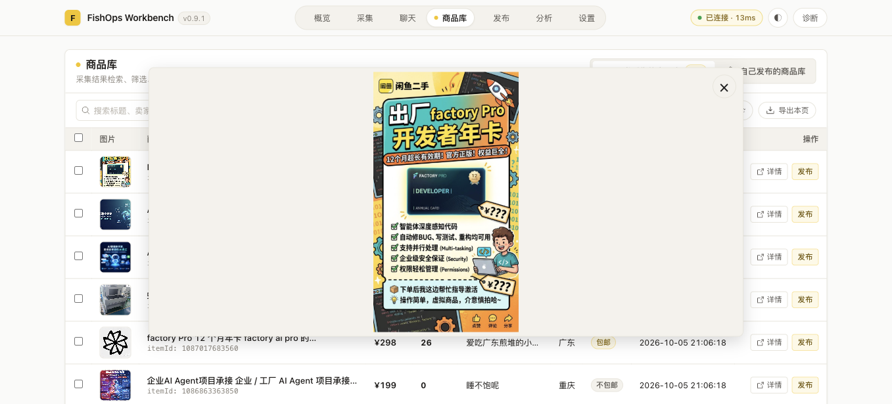
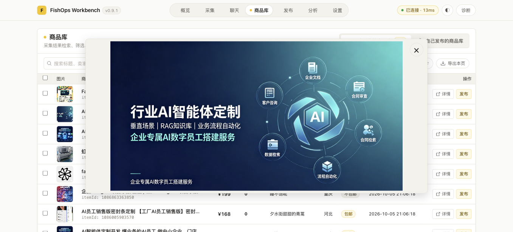

# Issue #11：商品库图片悬浮预览验收

## 范围与实现

- 商品库两类来源共用 `ProductImagePreview`。悬浮显示，移出关闭；`Teleport` 到 `body`，固定定位，不改变表格行高，不受滚动容器裁切。
- 预览居中，占视口宽、高的三分之二；图片使用 `object-fit: contain` 保持比例。加载完成前隐藏，失败后关闭。滚动、窗口调整、图片变化和组件卸载清理预览及监听。
- 想要数只显示有限数字，真实 0 显示 0，缺失显示「—」。发现 `mapCatalogProductToTableItem` 原先用 `p.wantCnt ?? 0` 混淆缺失与零，已建立失败回归后移除该补值。仅调整工作台展示模型，不修改共享协议、后台排序或数据存储。

## 自动检查

- 缺失值回归修复前失败：`AssertionError [ERR_ASSERTION]: 0 !== undefined`；修复后通过，覆盖飞书与当前账号两类来源的缺失、0、26。
- 新增预览定位测试：视口居中、宽高三分之二、窄屏及横屏。
- `npm run test --workspace @fishops/workbench`：387/387，通过，退出码 0。
- `npm run typecheck --workspace @fishops/workbench`：通过，退出码 0。
- `npm run build:workbench`：通过，退出码 0；产物输出 `extension/dist`。
- `git diff --check`：通过。

## 开发阶段浏览器检查（mock，不计入最终验收）

入口为 `http://127.0.0.1:5174/test/direct-runtime.html?image-preview`，通过实际 Vue 商品库页面操作，Vite 热更新加载本次代码。专用 runtime mock 提供 6 行商品、内嵌横竖 SVG、无封面与失败封面。没有读取账号凭据，没有真实发布或外部写入。

| 用户动作 | 状态与可见结果 | 副作用 |
|---|---|---|
| 进入自己发布的商品库 | 想要数为 6、26、0、—、2、3，标题保留「想要数」 | 仅 mock 查询 |
| 悬浮首行横图 | body 下显示预览，比例 320/120，contain，处于视口内 | 原行高与预览后均为 64.5px |
| 连续移到第二行竖图 | 对应第二行图片，比例 120/320，无旧图残留 | 无 |
| 移出图片 | 预览节点关闭 | 无 |
| 悬浮无图、加载失败行 | 保留原占位，无破损预览 | 失败请求仅指向本地缺失图片 |
| 切换紧凑，悬浮末行 | 44px 缩略图正常预览，底部不超视口 | 行高 53px，无布局跳动 |
| 滚动/窗口调整 | 预览关闭 | 清理监听 |
| 切出概览，再进入商品库 | 无残留，重新悬浮正常 | 清理卸载状态 |
| 选择想要人数排序 | `PRODUCT_CATALOG_QUERY` 保留 `order: wantCntDesc` | 排序契约未修改 |

## 真实环境 1:1 最终验收与截图

在当前 worktree 运行 `npm run agent:setup`，退出码 0，输出 `SETUP_COMPLETED：插件已重载，配置与权限状态已验证。`。该分支尚无此命令，本次临时复用主工作区现有 agent 脚本及 npm 命令配置，执行后恢复；未将部署脚本改动提交到 PR。

部署来源为当前 worktree、提交 `39d76b69`，真实入口 `chrome-extension://lnkgjbkfdimiloglccfmeefcclfgifbo/workbench.html`。通过真实扩展、真实商品库读取 20 行数据，未注入数据或使用 mock runtime（`window.__FISHOPS_TEST_HARNESS__` 不存在）。没有执行发布或远端写入。

- 默认行距首行悬浮：真实图片尺寸 768×1376，contain，预览位于视口内，行高前后均为 64.5px。
- 真实想要数展示为纯数字，前四行为 6、0、0、0。
- 移出关闭、紧凑行距悬浮第二行、连续切换对应正确图片、切出概览清理均通过。
- 未通过造数据来补齐边界：该次真实数据未覆盖缺失想要数和失败封面，其边界回归仅由开发阶段测试支持。

### 默认行距：真实商品图片放大

### 紧凑行距：切换真实商品图片

PR 等待人工 Review，不自动合并。

## 居中大图调整复验

按用户要求将预览改为屏幕中央，宽、高分别为视口的 2/3；实际图片仍保持比例，不拉伸、不裁切。新定位回归在旧实现上失败，修改后通过。工作台 387/387 测试、typecheck 通过；重新执行 agent:setup 完整构建、部署并重载成功（退出码 0，SETUP_COMPLETED）。部署包含本次未提交的代码改动。

真实扩展重新打开后，视口 1357×615，预览位置约 (226.16, 102.5)、尺寸约 904.66×410，符合居中及 2/3 比例；真实图片 768×1376 使用 contain，行高前后均为 64.5px。移出关闭、连续切换与页面切出清理通过，无 mock、无数据注入或外部写入。以上两张真实截图已更新为居中大图效果。

## 右上角关闭按钮复验

预览右上角增加 36×36px 的「关闭图片预览」按钮。预览可接收鼠标操作；移出缩略图或预览后延迟 500ms 关闭，移入预览取消计时，允许跨越间距操作按钮。点击立即关闭，组件卸载及其他关闭路径清理计时器。区域改为 region，避免交互按钮嵌在 img 语义内；按钮支持键盘操作，Escape 可从预览内关闭。

最终工作台 387/387 测试、typecheck 通过；agent:setup 完整构建及真实部署退出码 0，包含 SETUP_COMPLETED。真实商品库复验：移到右上角按钮后预览保持可见，按钮尺寸 36×36，点击后预览消失；再次悬浮可打开，移出后延迟关闭通过，无 mock 或数据注入。两张真实截图已更新为含关闭按钮的效果。未执行发布或外部写入。
