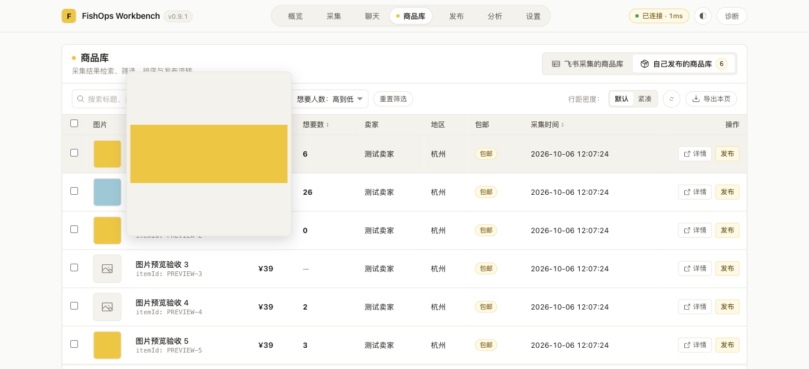
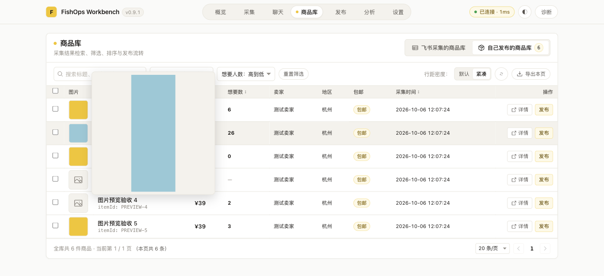

# Issue #11：商品库图片悬浮预览验收

## 范围与实现

- 商品库两类来源共用 `ProductImagePreview`。悬浮显示，移出关闭；`Teleport` 到 `body`，固定定位，不改变表格行高，不受滚动容器裁切。
- 预览最大 280px，按视口缩小并限制位置；图片使用 `object-fit: contain` 保持比例。加载完成前隐藏，失败后关闭。滚动、窗口调整、图片变化和组件卸载清理预览及监听。
- 想要数只显示有限数字，真实 0 显示 0，缺失显示「—」。发现 `mapCatalogProductToTableItem` 原先用 `p.wantCnt ?? 0` 混淆缺失与零，已建立失败回归后移除该补值。仅调整工作台展示模型，不修改共享协议、后台排序或数据存储。

## 自动检查

- 缺失值回归修复前失败：`AssertionError [ERR_ASSERTION]: 0 !== undefined`；修复后通过，覆盖飞书与当前账号两类来源的缺失、0、26。
- 新增预览定位测试：右侧优先、右边缘左侧打开、上下边缘限制、窄屏及紧凑缩略图。
- `npm run test --workspace @fishops/workbench`：388/388，通过，退出码 0。
- `npm run typecheck --workspace @fishops/workbench`：通过，退出码 0。
- `npm run build:workbench`：通过，退出码 0；产物输出 `extension/dist`。
- `git diff --check`：通过。

## 浏览器验收

入口为 `http://127.0.0.1:5174/test/direct-runtime.html?image-preview`，通过实际 Vue 商品库页面操作，Vite 热更新加载本次代码。专用 runtime mock 提供 6 行商品、内嵌横竖 SVG、无封面与失败封面。没有读取账号凭据，没有真实发布或外部写入。

| 用户动作 | 状态与可见结果 | 副作用 |
|---|---|---|
| 进入自己发布的商品库 | 想要数为 6、26、0、—、2、3，标题保留「想要数」 | 仅 mock 查询 |
| 悬浮首行横图 | body 下显示预览，比例 320/120，contain，处于视口内 | 原行高与预览后均为 64.5px |
| 连续移到第二行竖图 | 对应第二行图片，比例 120/320，无旧图残留 | 无 |
| 移出图片 | 预览节点关闭 | 无 |
| 悬浮无图、加载失败行 | 保留原占位，无破损预览 | 失败请求仅指向本地缺失图片 |
| 切换紧凑，悬浮末行 | 44px 缩略图正常预览，底部不超视口 | 行高 53px，无布局跳动 |
| 滚动/窗口调整 | 预览关闭 | 清理监听 |
| 切出概览，再进入商品库 | 无残留，重新悬浮正常 | 清理卸载状态 |
| 选择想要人数排序 | `PRODUCT_CATALOG_QUERY` 保留 `order: wantCntDesc` | 排序契约未修改 |

## 实际页面效果图

以下截图来自上述本地实际 Vue 页面，使用内嵌 SVG 测试图片，不是真实商品数据。

### 默认行距：横图悬浮放大与想要数纯数字展示

### 紧凑行距：竖图保持比例

## 验证边界

浏览器验收使用实际工作台页面及 mock runtime，不代表真实 Chrome 扩展账号、飞书表或闲鱼商品的联调验收。真实环境需重载构建后的扩展、刷新工作台，由人工 Review 后验证；不自动合并。
