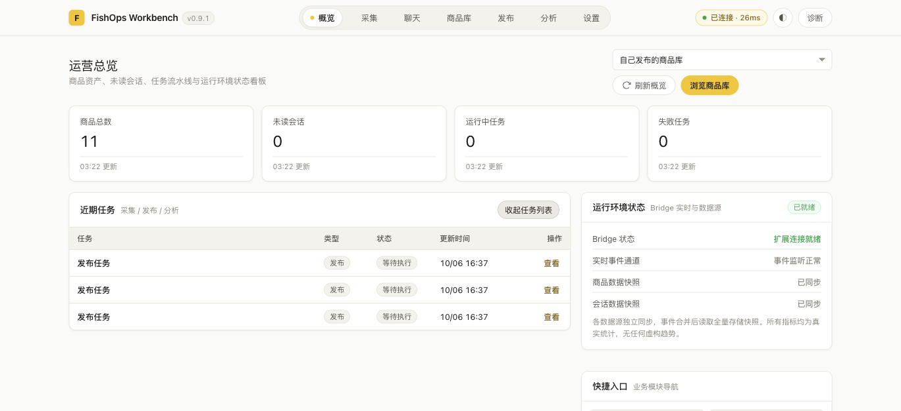
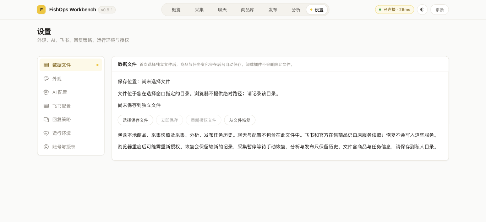
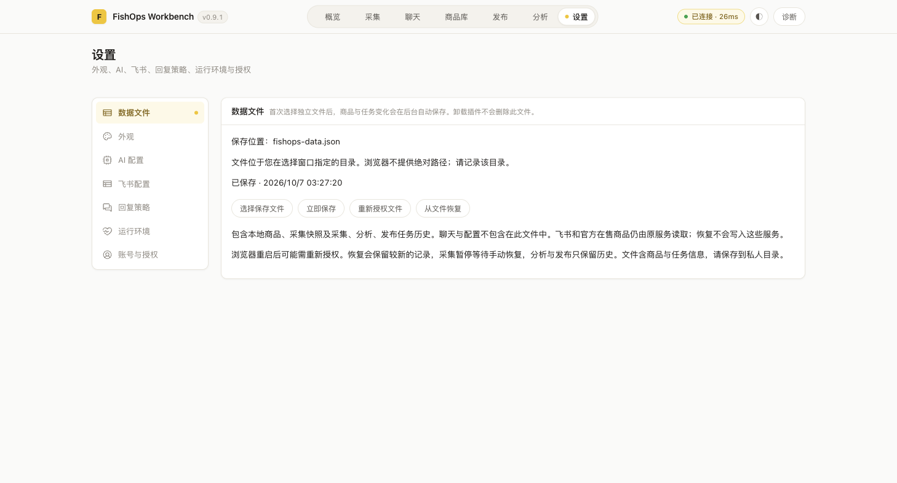
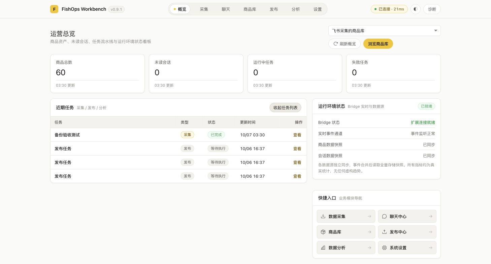
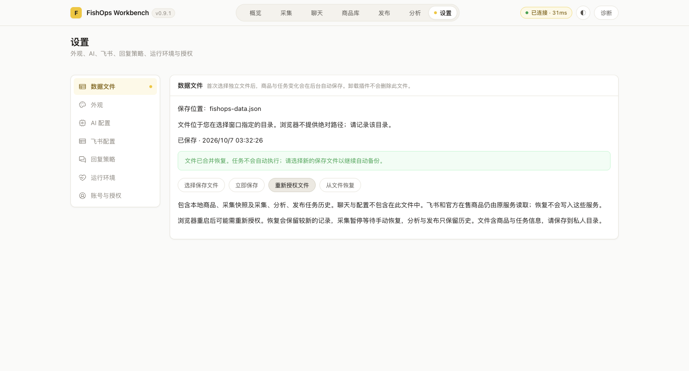
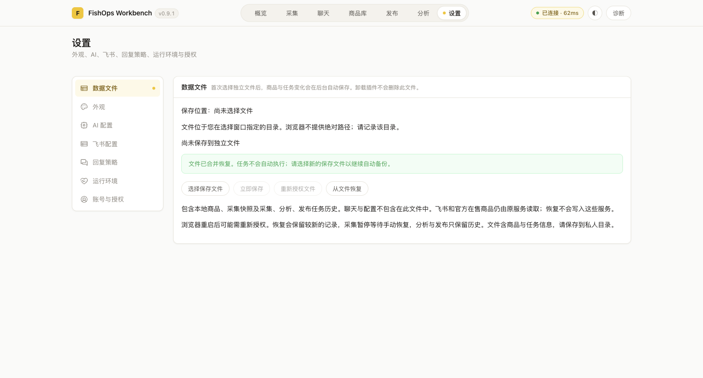
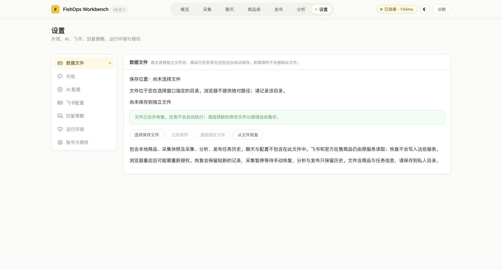

# Issue #15：概览与独立文件恢复

关联 Issue：<https://github.com/a1667834841/FishOps/issues/15>。
工作区：`/Users/wuwenjing/orca/workspaces/FishOps-Workbench/task`。
分支：`a1667834841/task`，基线：`2aa4b99`。

## 范围和实施步骤

本任务属于 D 类：涉及商品和任务持久化、旧记录迁移及文件恢复。

初始真实入口取证在 Ego 空间 314 完成：当时概览总数 60，飞书商品库总数 60，近期显示 3 条发布任务；未复现原截图中的 0。当前部署后的复核结果见下文空间 315 记录。

1. 概览使用商品库目录接口，默认飞书，可切换官方在售来源。目录 total 缺失时完整遍历游标，错误不当成 0。
2. 同一概览表可展开全量采集、分析、发布任务，保留更新时间降序和各模块入口。
3. 保留通用与发布存储前缀，通用任务由 session 迁移到 local，启动恢复仍按任务类型处理。
4. 首次由用户选定独立 JSON 文件；将文件句柄保存在 IndexedDB。后台合并任务事件，自动写入商品、原始快照和任务历史。文件自身独立于扩展生命周期。
5. 设置 → 数据文件显示文件名、保存时间、错误和恢复入口。浏览器不提供绝对路径，目录由用户在系统窗口选择。权限失效后通过真实点击重新授权。
6. 文件全量校验后合并恢复。商品和快照在一个 IndexedDB 事务中合并；任务按 ID 加锁，保留较新记录及现有活动任务。跨商品与任务存储没有全局事务；失败明确提示，可重复恢复补齐，原文件不变。

## 副作用和恢复边界

文件只包含扩展本地商品、商品快照及采集、分析、发布任务。聊天、密钥、配置不纳入；飞书及官方在售商品仍来自原服务。恢复不会写入飞书，也不会创建真实商品。

恢复的未完成采集暂停，需手动恢复；未完成分析标为失败；未完成发布标为取消。完成记录保留原状态。任务 ID 不重新生成，重复恢复不新增重复记录。

选择已有非空文件作为新保存位置会被拒绝，避免覆盖旧备份。自动写入先检查原文件版本和完整性，createWritable 在 close 成功前不提交；写入失败 abort，保留旧文件。卸载扩展会移除句柄和浏览器存储，用户文件仍由操作系统保留。重装后从文件恢复，再选择新保存文件。

## 验收计划

- 切换商品来源 → 清除旧来源计数并读取目录 → 总数与该来源商品库一致 → 仅读取。
- 已知分页、零数据和未知 total → 完整计数或明确异常 → 不将当前页当总数。
- 创建采集与发布任务、刷新和展开 → 统一列表更新 → 全量统计和模块列表一致。
- 选择文件、创建任务、后台更新 → 显示保存时间 → 独立文件含商品和任务。
- 重载及重启 → local 任务可查，文件权限失效时提示 → 无自动重复发布。
- 可恢复测试副本卸载重装 → 原文件仍保留 → 恢复商品及任务；重复恢复无重复项。
- 损坏文件、权限拒绝、写入失败 → 明确错误 → 原有效数据和文件保留。

## 验证记录

本地检查：

- `npm run regression:full`：最终完整轮次通过。本地全量单测、typecheck、构建、安全、Bridge、采集闭环、Service Worker 启动均通过。
- 同轮真实 E2E：Bridge、任务列表、聊天缓存、发布历史、7 个主页面、AI 连接、飞书连接共 13 项通过。真实空间 314；部署有 `SETUP_COMPLETED`，且来源为当前工作区。
- 本地报告：`.regression/2026-10-06T19-14-16-957Z-56228/report.json`。日志仅留本地，未纳入 Git。
- 后续增加手动刷新强制更新目录缓存、概览文件异常提示及 50 MB 写入上限。此最终修改后的概览 8 项、文件备份 5 项、备份控制器 3 项、部署 7 项定向测试均通过；再次 typecheck 和完整构建通过。备份控制器新回归先复现旧轮询覆盖保存结果的问题，修复后 3 项全部通过；最终 typecheck、构建和 diff 检查通过。
- 恢复事件修复后，主代理运行备份 6 项、概览/控制器 11 项、后台 166 项回归，typecheck 和完整构建均通过。随后以 `FISHOPS_REGRESSION_SPACE_ID=315 npm run agent:setup` 重新部署，退出码 0 且含 `SETUP_COMPLETED`；日志 `/tmp/fishops-15-setup-restore-event.log`。本轮复用这些结果，未重复运行全量检查。
- 第一轮仅备份状态类型声明未通过，已修复，第二轮通过。未将失败轮次写成通过。

### 最新真实界面验收：Ego 空间 315

部署前已确认没有运行中的任务；执行 `FISHOPS_REGRESSION_SPACE_ID=315 npm run agent:setup`，退出码为 0，日志 `/tmp/fishops-15-setup-315.log` 含 `SETUP_COMPLETED`。在真实扩展工作台 `chrome-extension://lnkgjbkfdimiloglccfmeefcclfgifbo/workbench.html` 的 p1 页面完成以下只读核验：

- 概览默认飞书来源显示 60，与商品库“飞书采集的商品库”徽标 60 一致。
- 概览切换到“自己发布的商品库”后显示 11，与商品库对应徽标 11 一致；旧来源计数被新计数替换。
- 概览“查看全部任务”展开后显示 3 条，均为发布任务、状态“等待执行”。再次收起并展开后仍为 3 条。
- 通过扩展只读命令读取并脱敏汇总：`TASK_LIST` 共 0 条；`PUBLISH_LIST` 共 3 条，类型均为 `publish`、状态均为 `pending`，接口 `total` 为 3。与概览列表的数量、类型和状态一致。未读取或记录任务正文、ID。
- 首次进入设置 → 数据文件时显示“保存位置：尚未选择文件”和“尚未保存到独立文件”。“选择保存文件”和“从文件恢复”可用；“立即保存”和“重新授权文件”禁用，符合尚未绑定文件时的状态。
- 点击“选择保存文件”前设置文件选择器监听，观察到 chooser 后调用 `task.handOff()` 交给用户。该阶段尚未核实真实文件创建；用户回复后重新接管空间，通过状态接口和文件句柄完成下述核验。未卸载扩展、删除数据或写入远端商品。

用户完成系统选择后，继续在同一空间 315 核实了真实文件：

- 状态接口与设置页均显示文件名 `fishops-data.json`、`phase=saved`、`error=null`；句柄权限为 `granted`。文件格式为 `fishops-data` v1，大小 141,999 bytes，含商品 60、快照 60、通用任务 0、发布任务 3。商品、快照和任务 ID 无重复；只记录结构与数量，没有输出记录正文。未发现聊天、密钥类字段。
- 点击“立即保存”后仍为 `saved` 且无错误，保存时间从 03:27:20 更新为 03:28:41。
- 部署恢复事件修复后的代码并重载固定扩展后，工作台报告句柄权限失效，概览及数据文件页都给出“文件权限失效，请重新授权”。通过真实“重新授权文件”按钮请求权限后，句柄权限查询为 `granted`，状态恢复 `saved`，时间更新到 03:31:55。未观察到仍待用户处理的系统窗口；记录为重新授权调用后权限已授予，不据此声称人工确认过权限提示。
- 重载工作台后再次进入设置页，保存文件名、授权句柄和已保存状态可读取；部署重启导致权限失效时的重新授权入口也已验证。
- 从真实采集页创建关键词“备份验收测试”的单页、单条采集任务。任务真实运行并完成，概览展开列表出现一条 `capture / completed` 任务；原有 3 条 `publish / pending` 草稿保留。后台自动写入后，文件大小增至 142,908 bytes，保存状态仍为 `saved`、`error=null`；文件现含商品 60、快照 60、采集任务 1、发布任务 3。通过句柄读取的内容已复制到本地私有测试副本 `.regression/issue-15-restore-source.json`，权限 `0600`，大小 142,908 bytes，SHA-256：`ce0e36d34848dddfcd264ddeac293bfe4f6bf7e088b9903fa655cedd2e71063b`。这是从用户选择文件复制的真实备份，不是 fixture；后续隔离恢复测试可用此副本。
- 没有提交真实发布、发送聊天消息或删除远端商品。

空间 315 的代表截图均为业务页原图：首次概览和未配置状态图为 1369 × 627；选择文件、重载、自动保存和隔离恢复结果图为 1458 × 786。第二次安装后的恢复图来自当前部署代码。

独立文件创建、手动保存、重载后权限重新请求、任务变化触发自动写入，以及隔离扩展副本两次安装和两次真实文件恢复均已验收。隔离恢复确认了商品、快照与任务恢复、活动任务不自动执行、重复恢复幂等和卸载副本后用户文件保留。浏览器整个进程重启、真实创建超过 8 条任务、新发布草稿创建、损坏文件及磁盘写失败未实测；相应的错误/边界逻辑仅有单测或定向回归证据，不记为真实 E2E 通过。固定原插件当前在扩展管理页缺失，原因未知，属于未解释的环境异常，不作为功能通过。主代理已复核证据，进入 PR review；未覆盖边界和环境异常在 PR 中保留。

固定扩展部署修复版本后的重复恢复验证：权限失效提示经“重新授权文件”调用后，句柄查询为 `granted`、状态恢复 `saved`；同一真实备份通过 UI 恢复两次，页面均提示合并成功。两次之后 `TASK_LIST` 仍为 1 条 `capture / completed`，`PUBLISH_LIST` 仍为 3 条 `publish / pending`，接口 `total=3`，各任务 ID 无重复；文件仍为 60 商品、60 快照、1 采集任务、3 发布任务，状态 `saved` 且无错误。现有 pending 发布记录因与备份中的活动记录同 ID 而保留原状态。空隔离扩展副本中的 `pending → cancelled` 已在下述首次与第二次安装验证。

隔离扩展副本目录为 `/Users/wuwenjing/.fishops/issue-15-restore-extension`，来自修复后的 `extension/dist`，未包含配置或密钥。用户手动加载后，空间 315 的 Chrome 扩展管理页显示名称“FishOps Issue 15 恢复测试副本”、ID `ephcceepfmkeehhlmabggekhcjhfjnop`；该 ID 在两次安装中一致。页面未展示系统来源目录字段，因此目录路径根据用户选择指令和本地构建目录记录。

隔离副本首次恢复前，其扩展内商品库、快照、采集任务和发布任务均为 0；概览商品源不可用提示属于未配置飞书连接，不代表本地数据读取失败。通过设置 → 数据文件的真实恢复入口输入私有备份副本后，页面显示合并恢复成功；`PRODUCT_LIST(source=all)` 为 60，IndexedDB 商品 60、快照 60，`TASK_LIST` 为 1 条 `capture / completed`，`PUBLISH_LIST` 为 3 条 `publish / cancelled`，`total=3`。所有列表 ID 唯一。恢复不会自动运行发布，原 `pending` 发布任务在空副本中均转为 `cancelled`。第二次从相同文件恢复后，所有数量、类型和状态保持不变，无重复记录。

在隔离副本 Workbench 页面调用 `chrome.management.uninstallSelf({showConfirmDialog:false})` 后该页面关闭。随后 `chrome://extensions/` 核对隔离副本 ID 已移除。用户选择的真实文件 `/Users/wuwenjing/Documents/fishops-data.json` 在卸载后仍存在，大小 142,908 bytes、权限 `0600`、格式 `fishops-data` v1，内容数量为商品 60、快照 60、采集任务 1、发布任务 3。文件自身 SHA-256 因 `savedAt` 更新而不同于测试副本；将两文件分别规范化后，商品、快照、任务和发布四个数据数组的 SHA-256 均一致，证明卸载副本没有删除或改写用户文件。

隔离副本卸载后，用户已在扩展管理页再次手动加载同一目录。第二次加载的名称和 ID 与首次相同；Workbench 的商品库、快照、采集任务和发布任务恢复前均为 0。通过 UI 输入用户原文件 `/Users/wuwenjing/Documents/fishops-data.json` 后，再次得到 60 件商品、60 个快照、1 条 `capture / completed`、3 条 `publish / cancelled`；运行中任务为 0，所有记录 ID 唯一。对同一原文件再次恢复后计数与状态不变，验证第二次安装后的幂等性。原文件仍有效、无重复记录，大小 142,908 bytes、权限 `0600`、SHA-256 `1162249ec8a7d147c2f972a8aa5010f2201cdbe487ae21ecc62121b3e9436246`。

隔离副本首次安装及卸载后重装期间，扩展管理页都未显示固定原插件 ID `lnkgjbkfdimiloglccfmeefcclfgifbo`；该缺失在首次调用隔离副本 `uninstallSelf` 之前已出现。原因未知；没有通过 `npm run agent:uninstall` 或其他命令卸载固定插件。此事实已向主代理报告。不得推断由用户或代理造成。

首次隔离副本恢复及重复恢复截图：

部署脚本的会话问题：指定 `FISHOPS_REGRESSION_SPACE_ID` 时，现在部署会复用该空间并保持活动，避免切换到历史空间以及提前结束验收。普通部署保留原完成行为。完整回归自身仍会结束空间，专项验收需用户允许恢复。后续可将专项用例纳入该脚本，在统一结束前执行。

Issue 中引用的 `docs/development-testing.md` 已不存在，本次按 `docs/workflow/test.md`、`test-e2e.md` 和 `docs/regression-testing.md` 执行。

空间 315 在验收结束后已执行 `task.finish({ keep: [] })` 并确认完成。未卸载重新安装的隔离副本，也未清理浏览器数据。
