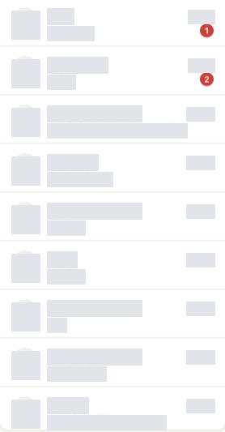
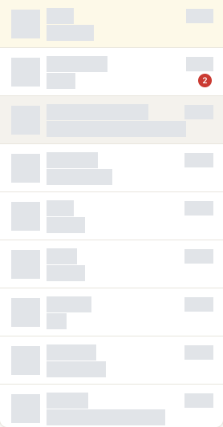
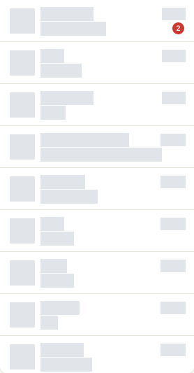
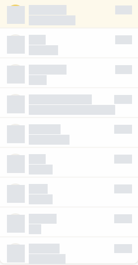

# Issue #16 执行记录

当前结论：修复已完成，最终定向回归 33/33、本地检查及完整 `regression:full` 均通过；真实新入站、平台字段及刷新复查通过。自动发送和手机出站暂停使用安全替身验证，未执行真实外发。以下保留历史阻碍与恢复过程，最终交付状态见末节。

## 任务与工作区

- Issue：https://github.com/a1667834841/FishOps/issues/16
- 认领：https://github.com/a1667834841/FishOps/issues/16#issuecomment-6025378603
- worktree：`/Users/wuwenjing/orca/workspaces/FishOps-Workbench/auto-issue-pr-run-18-20261006T2100`
- 分支：`fix/issue-16-realtime-reply`
- 最新主分支基线：`2aa4b99a2cc37b3fdbf0f97e5fc6bd2b223f0bc8`
- Commit、Push、PR：尚未执行。
- 阶段：plan；因真实环境首次加载阻碍暂停。
- 当前执行终端：`term_cc267f5d-29b1-4be6-bfb0-c4a1bbcaffba`。已核对工作区唯一 Codex 终端及本次对话预览，执行 `orca terminal switch --terminal <handle> --json` 返回成功。未关闭终端或清除会话。

## 选择与静态调查

检查全部开放 Issue 的负责人和评论，排除已认领的 #5、#17、#18、#29、#31。#16 无负责人、无认领评论，现有全部 PR 未覆盖此问题；已留言认领。

已确认 `extension/src/background/index.ts` 的 `enqueueChatIngest()` 仅调用 `runtime.ingestSocketEvent(payload)` 并广播聊天事件，没有调用回复运行时。`reply-runtime.ts` 的 `handleIncomingMessage()` 包含自动决策、发送和非 Web 出站暂停，但未接入此入口。

尚需确认真实帧的平台字段、方向、历史重放和去重边界；不能直接把全部缓存或全部 socket 消息接入自动发送。影响属于 D 类，涉及真实发送边界。自动发送验证使用禁止外发的安全替身，不修改真实回复配置、不发送真实消息、不调用真实 LLM。

## 检查记录

所有命令均在上述 worktree 执行，业务代码未修改。

| 检查 | 退出码与结果 |
| --- | --- |
| `git fetch origin main` | 0，成功同步远端主分支 |
| `git merge --ff-only origin/main` | 0，已为最新主分支 |
| `git switch -c fix/issue-16-realtime-reply` | 0，建立任务分支 |
| GitHub Issue/PR 读取与认领 | 成功；一次读取使用不支持的 `timelineItems` 参数，改用支持的字段后成功 |
| 规范读取 | `docs/development-testing.md` 已不存在；使用现行 `docs/workflow/test.md`、`docs/regression-testing.md`、测试授权和证据规范 |
| 真实工作台导航 | 1，`net::ERR_BLOCKED_BY_CLIENT`；未取得工作台业务状态 |
| 同空间扩展管理页调查 | 0，未发现 FishOps 测试扩展实例；仅记录扩展状态，未修改其他扩展 |
| 固定目录存在性 | 0，`~/.fishops/agent-extension` 存在；不代表已安装或加载 |
| 定向测试、完整回归、构建、部署 | 未执行，真实入口取证尚未完成 |

## 真实验收与副作用

ego-browser 空间 317，页面 p1。动作：打开真实扩展工作台 → 状态：导航被阻止 → 可见结果：未进入业务页 → 副作用：未执行业务操作。调整调查方式：在同空间打开 `chrome://extensions` 并只读检查，未发现 FishOps 实例。

真实验收未通过。未注入或伪造业务数据，未读取聊天正文或凭据，未发送、发布、写飞书、调用 LLM 或改账号配置。没有修改业务代码，不能声明已修复。

## 人工处理与恢复

按 `docs/agent-testing.md` 首次加载规范，请在同一 ego lite 空间 317 手动加载 `~/.fishops/agent-extension`，在本执行对话中确认。保留当前执行会话并标记工作区未读。

确认后恢复同一工作区和浏览器空间，检查真实入口及安全边界，补失败回归，再做最小修复、定向检查、完整回归及专项真实验收。验收通过后才 Commit、Push 和创建关联 PR；创建后等待人工 Review，不自动 Merge。

## 2026-10-07 恢复与重新部署

用户确认已首次加载，明确要求重新打包和加载。核对本次终端 handle 未变，再执行 terminal switch 成功；恢复原空间 317，固定目录实例 `lnkgjbkfdimiloglccfmeefcclfgifbo` 为 ENABLED。部署前 `TASK_LIST` 和 `PUBLISH_LIST` 成功，运行中任务均为 0。

| 命令或动作 | 退出码与结论 |
| --- | --- |
| 首次 `npm run agent:setup` | 1，工作区未安装依赖，`vite: command not found`；固定目录未更新 |
| `npm ci` | 0，依赖安装成功 |
| 第二次 `npm run agent:setup` | 1，构建和固定目录更新成功；配置脚本指向旧空间 315，配置未完成 |
| 调整部署空间记录 | 将 `~/.fishops/agent-ego-state.json` 绑定为当前任务空间 317；原记录备份 `/tmp/fishops-issue16-agent-state-before.json`，未操作旧空间 |
| 第三次 `npm run agent:setup` | 0，完整构建、同步固定目录、重载、配置导入成功，包含 `SETUP_COMPLETED`；AI/飞书配置和 AI 域名权限状态为 true |
| 恢复空间 | 部署脚本主动 finish，按既有授权恢复同一空间 317；未改用其他空间 |
| 真实聊天导航 | 首次按钮名称使用“聊天中心”匹配失败；核对 DOM 真实 tab 为“聊天”，调整后成功 |
| 真实只读状态 | `CHAT_STATUS`、`CHAT_LIST_CONVERSATIONS`、`CHAT_AUTO_REPLY_STATUS` 成功；socket=open、会话=15、消息缓存=0、自动回复 enabled=false |

日志保存在 `/tmp/fishops-issue16-setup.log`、`/tmp/fishops-issue16-install.log`、`/tmp/fishops-issue16-setup-2.log`、`/tmp/fishops-issue16-setup-3.log`。部署来源是当前 worktree，基线提交 `2aa4b99a`；业务代码尚未更改，dirty 仅包含本执行文档。

重新打包和重载要求已完成。真实业务验收仍未完成：当前无消息缓存，不能从连接成功推导新消息触发、历史重放和平台归属正确。静态进一步确认 `ChatMessage` 和实时 parser 均没有保留 platform；回复暂停引擎要求非空且非 web 的 platform。需要真实新消息的必要脱敏结构证据，不能猜测字段后将消息接入自动发送。

已在执行对话中请求用户通过测试账号产生一条新入站测试消息并确认，再继续同一空间的只读调查、失败回归和最小修复。没有自动发送、真实 LLM 请求、飞书写入、发布或伪造浏览器数据。业务修复、定向测试、完整回归、Commit、Push、PR 仍未执行。

## 接线实施计划

真实入口已恢复，socket=open，会话可读取；当前尚未取得新消息帧证据。额外读取 `origin/chat:inject/chat-parser.js`，确认对象型 sync 的 `chatInfo._platform`、字符串型 sync 的 `contentData._platform` 及普通实时体的 `extension._platform` 为原迁移契约。补充纯模块失败回归，不执行业务写入。

实施范围：恢复可选 platform 字段；同步结果仅向后台内部返回本批新增消息；可信来源入库后，仅对有可靠当前用户、明确方向且创建时间不早于本轮后台启动的消息排队调用回复运行时。重复缓存和启动前历史重放不补发；聊天队列与回复队列分开，失败隔离并广播回复事件。未知平台不猜测。保持历史同步入口只读，不扩展其他模块。

验收：可信新入站 → 入库 → auto 规则用安全替身只发送一次；禁用/重复/历史/不可信 → 无外发；非 Web 新出站 → 暂停事件；Web/未知来源 → 不误暂停；失败/慢回复 → 后续聊天继续入库。真实入口验证维持 enabled=false，不发送真实消息或调用 LLM。

## 2026-10-07 实现与最终检查

已完成最小业务修改，尚未 Commit、Push 或创建 PR：

- `parser.ts` 从原迁移契约的 `_platform` 恢复可选平台字段；对象型 sync、base64 sync 和普通实时体均覆盖；未知来源不猜测。
- `ChatSync` 在批量入库前按现有会话与去重键筛出本批新增消息，排除同批重复、缓存命中和已同步历史。没有可靠当前用户时仍保存消息，但不交给自动回复。保留原批量持久化，避免逐条读写 session 缓存。
- 后台真实 socket 入口使用 `createChatReplyIngestor`。来源和负载校验后先入库，聊天与回复使用独立串行队列。慢回复或单条异常不阻塞后续入库；回复与暂停事件被广播，异常不记录正文且不自动重试发送。
- 宿主在 socket 帧中附加可选 `connectedAt`，保持当前连接观察边界跨 Service Worker 唤醒有效；连接前补推、未来时间不触发。旧宿主缺少该字段时回退到后台启动边界。codec 拒绝非数字、非有限、负数和晚于事件时间的边界。
- 接线沿用现有回复引擎的总开关、模式、规则匹配、冷却、去重和发送安全闸，不改变真实测试配置的禁用状态。

### 回归与构建证据

下列命令均在本任务 worktree 执行。基线 Commit 保持 `2aa4b99a`，业务修改未提交。原始本地日志已复制到当前工作区 `.regression/issue-16-execution/`，不提交 Git。

| 检查 | 结论 |
| --- | --- |
| 平台映射失败回归 | 原实现返回 undefined 而期望 web；退出 1，属于预期红态 |
| 后台接线初始红态 | 原实现没有新接线模块，模块导入失败；与静态缺少调用点的证据配套，不把该导入失败当行为断言 |
| Service Worker 唤醒失败回归 | 仅按后台启动时间过滤会丢首条新消息；宿主连接边界修复后通过 |
| 开发检查修正 | 一次 shared 聚合入口未导出类型/常量，改用实际类型模块路径后通过；无相同错误反复重试 |
| 最终定向回归 | `node --import ./extension/src/background/__tests__/register.mjs --test extension/src/background/__tests__/chat-reply-ingest.test.ts extension/src/chat/test/parser.test.ts extension/src/chat/test/chat-host.test.ts`，退出 0，33/33；日志 `fishops-issue16-targeted-complete.log` |
| 最终本地交付回归 | `npm run regression`，退出 0；全量单测、三包类型检查、完整构建、安全检查、Bridge 冒烟、采集闭环和 SW 启动全部通过；报告 `.regression/2026-10-07T06-31-44-506Z-13676/report.json` |
| 完整编排 | `FISHOPS_REGRESSION_SPACE_ID=317 npm run regression:full`，退出 1；本地层与部署成功，E2E 在部署结束空间后未继续；报告 `.regression/2026-10-07T06-25-50-167Z-97410/report.json`。该命令不能标为通过 |
| 同空间真实基线续跑 | 恢复部署脚本主动结束的空间，先适配被释放为未管理状态的工作台页，再使用原 `regression-browser.mjs` 用例及断言续跑。仅为继续专项而保留任务空间，不修改项目编排脚本；13/13 通过。最终版结果见 `.regression/issue-16-baseline-resumed.json` 和 `fishops-issue16-baseline-final-delivery.log` |
| 最终部署 | `npm run agent:setup`，退出 0，包含 SETUP_COMPLETED；日志 `fishops-issue16-batch-final-setup.log`。来源为当前 worktree；随后仅增强测试断言，没有改业务代码 |
| 最终 diff | `git diff --check`，退出 0 |
| CI | 未运行，尚未创建 PR |

定向用例使用真实 ChatRuntime、ChatStore、parser 和回复运行时，自动发送 transport 是禁止外发的替身。覆盖 auto 与禁用、规则未匹配、重复、历史、不可信来源、手机出站暂停、Web/未知平台不暂停、异常/在途回复不阻塞、同批去重、Service Worker 唤醒及非法边界。模块回归不能代替真实新消息验收。

### 最终真实入口与待验收

同一 ego-browser 空间 317，工作台 p1，任务新建的闲鱼页 p2。最终部署后刷新本任务闲鱼页并执行真实 `CHAT_RUNTIME_PREPARE`：socketReady=true、userIdReady=true，`CHAT_STATUS` 为 open、16 个会话、消息缓存 0，自动回复 enabled=false。

13 项真实基线通过，包括 Bridge、任务/聊天缓存/发布历史读取、7 个页面、AI/飞书连接。AI 基线按仓库既有测试授权使用固定提示词；没有向 LLM 发送聊天业务数据，未生成真实 AI 回复。未发送消息、发布或写飞书；页面只读打开和刷新，没有标记已读操作、删除或伪造数据。仅测试配置导入采用部署脚本已授权的本地配置流程。

用户表示从其他账号向测试账号发送消息。当前没有观察到新消息进入缓存；运行中多次部署会重载扩展，因此重载前消息只能作为历史，不可当最终版本的新消息触发证明。已在本对话请求最终部署后的新入站消息。真实新消息、真实手机出站暂停等专项仍未通过；禁止把 socket 连接和会话数量当业务触发验收。

需要用户在最终已就绪版本上再发一条新入站测试消息并确认。确认后读取必要脱敏结构与状态，完成受影响业务验收和自查，再 Commit、Push、创建关联 PR。当前保留全部修改、证据与执行终端，等待人工补充测试输入；不自动合并。

## 最终新入站专项验收

用户确认从另一账号发送了一条测试消息后，在原空间 317 读取必要脱敏结构：缓存从 0 增至 1，source=realtime、direction=in、platform=android、kind=text，服务端消息 ID、发送者与接收者字段均存在。没有读取或输出正文、账号 ID 和凭据。

再次刷新工作台后，消息缓存仍为 1，socket=open，自动回复 enabled=false、processedCount=0、aiPaused=false。真实新入站、平台映射和再次进入缓存检查通过；未产生真实回复或 AI 暂停。自动发送和手机出站暂停由真实 runtime + 安全替身回归覆盖，未宣称真实外发验收。

交付前 fetch 确认主分支新增 `06dd5e2`（PR #39），其中已提供 `FISHOPS_REGRESSION_SPACE_ID` 复用且保持活动空间的部署路径。下一步同步该主分支，并重新运行完整回归，核对接线未变及新基线集成；历史编排失败记录仍保留。

## 最终交付状态

- 最新主分支：`06dd5e2`。业务实现 Commit：`01665d0f74a63cb96d9c8fdb23ba3fdfc7b5defb`。同步主分支前为 `3ae3530`；`git range-diff 2aa4b99..3ae3530 origin/main..HEAD` 显示补丁相等，无冲突、无业务实现变化。
- 最终完整命令：`FISHOPS_REGRESSION_SPACE_ID=317 npm run regression:full`，在本任务 worktree 执行，退出码 0。报告 `.regression/2026-10-07T06-55-39-518Z-53938/report.json`；详细日志 `.regression/issue-16-execution/final-regression-full.log`。
- 最终本地层：全量单测、shared/extension/workbench 类型检查、完整构建、安全检查、Bridge 冒烟、采集闭环和 SW 启动均通过。
- 最终真实层：部署来源为当前 worktree 和上述业务 Commit，包含 SETUP_COMPLETED；Bridge、任务读取、聊天缓存、发布历史、概览/采集/聊天/商品库/发布/分析/设置 7 个页面、AI/飞书连接共 13 项均通过。
- 此前的完整编排失败由主分支新增的空间保留路径解决，最终完整命令通过；没有把旧失败结果修改为通过。
- 新入站专项：用户真实发送的 Android 文本消息经 realtime 入库为 1 条，方向为 in、platform=android；刷新工作台仍为 1 条，自动回复禁用，无重复消息、真实外发或 AI 暂停。同步后 patch 未变；新基线的完整集成回归通过，复用有效专项证据。
- 真实手机出站、真实 auto 外发未执行；这些行为及安全边界由真实 store/runtime + 禁止外发 transport 的回归覆盖。未人为伪造真实消息或破坏外部数据。
- CI 待 PR 创建后执行，本地结果不代替 CI。最终证据更新仅修改本文档，不改变已验证的业务代码。
- 自查只包含 Issue #16 的来源/去重/平台/队列/连接边界及测试；没有带入主分支 #39 的额外改动。`git diff --check` 与暂存区检查通过。
- 真实测试空间已由成功基线脚本按规范结束；执行终端和会话继续保留在当前工作区。提交后进入 pr review，PR 创建后停止，不自动 Merge、不提前关闭 Issue。

## 人工反馈追加：未读角标与定位

用户明确要求：会话显示未读消息条数，点击概览未读入口打开对应未读会话。本轮在同工作区、原 PR #40 中继续，范围扩展由该人工反馈授权。

真实调查：概览读取到 1 个未读会话，计数为 2；等待聊天列表完成后，该行已存在可见的 2 条未读角标（宽 17px），未选中任何会话。不能声明当前截图已复现“完全无角标”。静态确认：实时摄入只写消息、不更新会话摘要/计数；概览卡片只切换 page，不带目标 sessionId。

计划：新增实时消息按去重结果更新会话摘要及未读计数，保留平台快照作为计数水位，避免补推重复累加；点击概览入口重新读取最新未读快照，选择最近的未读会话，通过应用本地导航传入聊天页。无未读时不选其他会话；失败提示、请求期间防重复、卸载后不跳转。沿用现有选择会话→读取→平台确认已读后清零行为。

验收：后台新增入站→会话计数与角标更新，重复/历史/出站不乱计；概览未读点击→正确会话选中→消息可见→确认已读后角标清除。追加失败回归后实现，执行完整回归与真实入口，并对真实图进行敏感区域遮盖。测试中不发消息、不调用业务 LLM。

### 追加验证进度（2026-10-07）

- 当前业务修改尚未提交，已有 PR #40 保持 OPEN。定向命令见本地 `unread-final-targeted.log`（29/29）和 `unread-final-navigation.log`（10/10）。类型检查首次因默认会话构造在空值分支仍引用 existing 属性失败；删除这两处无效引用后，`unread-final-typecheck-retry1.log` 退出 0。
- `FISHOPS_REGRESSION_SPACE_ID=317 npm run regression:full` 退出 0；报告 `.regression/2026-10-07T07-37-18-926Z-23360/report.json`，日志 `unread-regression-full.log`。本地全部检查、构建、部署及 13 项真实基线通过。
- 最终页面专项：真实数据有 2 个未读会话，分别 1 和 2 条；点击概览未读入口选择最近未读，`correctTarget=true`，选中 1 行，消息显示。平台已读请求超时，页面明确保留计数并提示失败，不能标记已读清零通过；详见 `unread-real-e2e.log`。
- 原空间基线结束后工作台标签被释放，需要重新 adopt。首次专项脚本使用相对文件路径失败，改为工作区绝对路径；已保留原错误，不重复同方案。
- 截图核查更正前述调查结论：角标元素虽存在且有宽度，但长摘要使 `.convs` 默认网格轨道超过面板宽度（时间文本 x≈1763，列表右边界≈428），角标实际被裁切。新增 `grid-template-columns: minmax(0, 1fr)` 约束列表轨道。这是用户反馈不可见的直接布局根因，先前仅验证 DOM 存在的判断不充分。
- 布局修正后重新运行完整回归，最终结果与新截图待补。当前真实新入站计数也待最终版本部署后的用户消息；不复用重载前消息作触发证明。
- 既有 PR 提交的 CI 构建与 GitGuardian 为 SUCCESS；不代表本轮未提交修改的 CI。未发送真实消息、删除数据或调用业务 LLM。

### 布局修正后最终检查

`FISHOPS_REGRESSION_SPACE_ID=317 npm run regression:full` 再次退出 0；报告 `.regression/2026-10-07T07-40-23-905Z-32162/report.json`，日志 `unread-layout-regression-full.log`。最终源码完整构建及部署通过，13 项真实基线通过。

最终真实列表有 16 行；两枚角标分别为 1 和 2，宽 17px，均完整位于列表列内（insideList=true）。截图为实际测试账号数据，仅裁切会话列并遮盖头像、昵称、摘要和时间，不替换业务数据；此图验证角标可见，不代表平台已读成功。

当前等待用户最终版本新入站测试输入，并保持闲鱼聊天页面打开以复查已读请求。代码、日志及执行对话保留在本 worktree；Orca test 状态及未读标记已读回。追加修改暂不 Commit/Push，不把超时验收标为通过。

## 进入会话后已读超时排查

用户截图确认进入会话后仍显示未读数字及平台已读请求超时，并明确要求继续修复。

当前真实闲鱼聊天页 socket=open。浏览器存在多个 /im 标签，背景运行时按缓存/活动/顺序选取标签，因此当前空间的原型诊断未捕获背景请求，不能据此断言未发送；直接调用当前空间 /im 页的受控 markRead 仍超时。诊断只读取帧结构，不打印正文、账号或 messageId。长等待改为页面异步结果轮询，避免 evaluate 的 15 秒限制；旧诊断原型已恢复。

对照当前闲鱼页面实际加载的公开脚本 `https://g.alicdn.com/idle-pc/xy-site/0.0.176/js/p_im-index.js`：clearRedPoint 的嵌套列表与当前实现相同；原生 LWP `_sendRequest` 构造 `数字 ID + " 0"`，响应使用空格前请求 ID 关联。我们的已读 transport 默认采用 `read-时间-序号`，与原生格式及共享 generateMid 契约不一致。改为复用共享 generateMid；此差异是否足以解决真实超时，待部署后实测，不先宣称根因已证实。

新增默认 mid 格式回归：修复前失败（`read-mid-red.log`），修复后已读 transport / adapter / host 共 24/24（`read-mid-green.log`）。失败断言前先结清 promise 和计时器，避免测试挂起。完整回归与真实确认进行中。

### 已读请求格式修复后的验证

- 最终 `FISHOPS_REGRESSION_SPACE_ID=317 npm run regression:full` 退出 0，报告 `.regression/2026-10-07T07-52-37-416Z-55128/report.json`，日志 `read-mid-regression-full.log`；完整本地、构建、部署及 13 项真实基线通过。
- 刷新当前测试空间 /im 页后，直接使用真实 MAIN world 受控 markRead，返回 `{ok:true,code:200}`。同一浏览器调用内 CDP 捕获一条 clearRedPoint 请求和对应 code=200 响应，两者 mid 都符合平台数字加空格标志格式。没有打印服务端 ID、会话 ID、正文或凭据。此前同页旧格式超时，当前格式得到成功确认，证实请求格式修复有效。
- 工作台完整路径仍超时。浏览器同配置下有两个 /im 标签；背景运行时使用缓存标签优先，工作台 markRead 未进入当前测试空间 /im 页，而该页直接调用新版本成功。因此旧聊天页未重载是当前整条链路验收的环境阻碍；没有刷新其他任务未知归属的标签。
- 本对话已请求用户刷新或关闭重复旧聊天页。收到确认后重新检查工作台选择会话 → 平台 ACK → 本地未读清零 → 概览计数更新。该完整路径未通过前不 Commit/Push，不声明验收全部通过。
- 本次直接已读成功已产生正常平台已读副作用；未发送消息、删除数据或调用业务 LLM。执行终端继续保留。

### 工作台完整已读链路通过

用户明确授权自行刷新重复聊天页后，刷新当前浏览器中的 2 个 /im 页面；后台此后使用新版本 host，工作台选中的 1 条未读角标清除，另一个会话的 2 条保持。刷新瞬间 listNewestPagination 先出现 code=400；等待连接完成后按页面“重试同步”正常同步，告警消失，没有继续盲目重试或隐藏错误。

随后真实概览计数从 2 降至 1；再次点击未读入口定位另一会话，其 2 条角标也清除，返回概览计数为 0。两次正常平台已读操作通过，未发送任何消息。无未读时点击入口仅进入聊天页，不误选旧会话。真实页面再次操作和概览对账通过。

图片来自最终已部署代码与真实账号，裁切会话列，遮盖头像/昵称/摘要/时间；黄色选中行没有角标，其他会话保留 2。最新实时入站恢复计数仍待用户新消息，不把模拟用例当真实新消息证明。

## 追加修改最终交付验收

用户确认新消息已发送后，在最终部署版本、原空间 317 上观察到概览未读会话为 1；聊天列表有一枚完整位于列内的 2 条角标，未选中会话。后台读取到最近 10 分钟内 2 条 source=realtime、direction=in 的入站，messageId 均唯一；平台字段分别为未知和 android。只读取脱敏结构，没有输出正文或账号 ID。真实新入站自动更新计数和角标通过。

从概览再次点击未读入口，选中 1 个会话；平台确认已读后未读角标为 0，错误提示为 0，返回概览未读会话为 0。此次不手动同步列表，不人工清除计数；新入站 → 未读定位 → 平台 ACK → 本地角标清除 → 概览对账整条真实链路通过。脱敏详细结果为 `.regression/issue-16-execution/unread-live-final.json`。

最终截图来自本轮源码真实部署，仅裁切会话列并遮盖敏感区域。当前配置继续禁用自动回复，没有真实外发、业务 LLM 调用或数据删除。正常平台已读是本次验收的明确副作用。

最终源码检查已由 `.regression/2026-10-07T07-52-37-416Z-55128/report.json` 完整回归覆盖，随后仅执行真实专项和更新证据，没有再次修改业务代码。自查范围包括未读快照水位、批次/缓存去重、连接窗口、会话摘要、列宽约束、导航生命周期与平台 mid；`git diff --check` 通过。最终新增源码 CI 待 Push 后执行，不能沿用旧提交的 CI 成功结论。

此前等待新消息、旧聊天页和已读超时的阻碍均已解决。追加修改更新原 PR #40，不创建重复 PR；进入 pr review 并保留执行对话，等待人工 Review，不自动 Merge。

### 追加交付提交

追加业务和最终截图 Commit：`31e3b77`（`fix(chat): 同步实时未读并修复会话定位与已读确认`）。测试时 HEAD 为 `c16dcfe` 且工作区有修改；本提交收录的业务源码与最终完整回归、真实专项时一致，未在验收后变更源码。当前 worktree 与分支沿用本文开头记录，PR：https://github.com/a1667834841/FishOps/pull/40 。本段为交付元数据，不需要重新运行应用测试。
