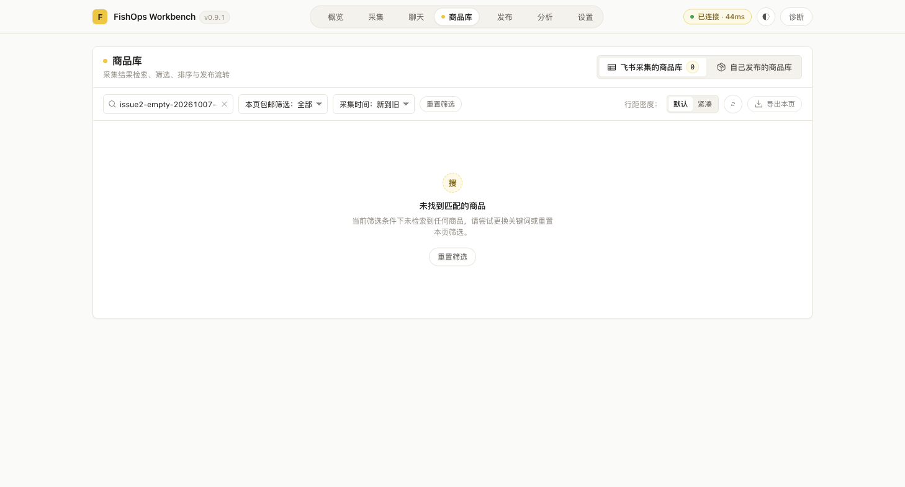
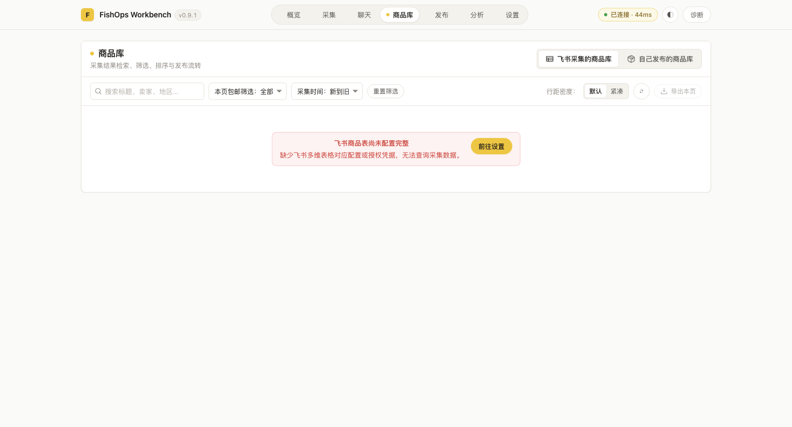

# Issue #2 商品库状态验证

关联：<https://github.com/a1667834841/FishOps/issues/2>。

## 改动及验收场景

- 查询首页无匹配结果且没有后续页 → 正常返回空列表、数量 0 → 使用现有空状态，无错误提示。
- 缺少飞书配置 → 返回 `INVALID_PAYLOAD` 和 `CONFIG_MISSING` → 现有商品库配置提示及「前往设置」入口可识别。
- 飞书网络等真实故障 → 保留飞书运行时的脱敏错误类型及提示 → 不转换为空列表；未知底层异常仍返回固定安全文案。
- 已配置且有数据 → 保持现有映射、数量及缓存契约；后续空页和仍有后续页的未知总数保持 `null`。

## 开发阶段验证

修改前新增的两项回归失败：缺少配置返回 `INTERNAL`；空首页总数返回 `null`。
修复后商品目录定向回归 24/24 通过，包含现有正常数据映射及缓存用例。
控制器配置提示用例改用后台实际返回的文案，不再仅测试与后台不同的模拟错误。

完整回归命令：`FISHOPS_REGRESSION_SPACE_ID=310 npm run regression:full`。
本地七项检查均退出 0：全量单测、类型检查、构建、安全检查、Bridge 冒烟、采集闭环和 Service Worker 启动检查。
首次真实阶段在空间 310 的 `preflight` 失败。用户授权接管后再次执行完整回归，本地七项检查通过，空闲检查通过，`agent:setup` 退出 0 且输出 `SETUP_COMPLETED`。
部署来源确认：当前 worktree、基线 `14935cc` 加本次未提交源码，固定目录 `~/.fishops/agent-extension`。
部署脚本调用 `task.finish()` 后交回空间，导致统一入口后续检查中断，完整回归命令仍退出 1。未修改回归编排脚本，也不宣称该命令整体通过。
按用户授权在同一空间 310 续跑原 `scripts/regression-browser.mjs` 的 `checks` 阶段：13/13 通过，包含 Bridge、任务、聊天缓存、发布历史、7 个页面、AI 连接及飞书连接；输出 `REGRESSION_RESULT` 的 `ok` 为 `true`。
完整回归报告：`.regression/2026-10-06T18-24-47-786Z-4417/report.json`。续跑脱敏结果：`/tmp/fishops-issue2-real-checks.log`。本地日志不提交。

## 真实验收边界

用户明确授权接管空间 310，整个验收复用该空间。

| 用户动作 | 实际结果 | 副作用及边界 |
| --- | --- | --- |
| 打开真实扩展商品库 | 飞书商品数量 60，首页显示 20 行 | 只读现有真实飞书记录 |
| 搜索不匹配关键词 | 数量 0，显示「未找到匹配的商品」，没有错误块 | 真实查询响应，未替换业务数据 |
| 暂时将本地飞书配置专用键设为 `null`，切出再进入商品库 | 显示「飞书商品表尚未配置完整」和「前往设置」 | 配置备份仅在内存，`finally` 恢复原值，不回显凭据 |
| 点击「前往设置」 | 成功进入真实设置页 | 未提交设置表单 |
| 恢复原配置，再进入商品库 | 数量恢复为 60，首页 20 行正常显示 | 配置恢复已核对 |

未人为制造真实服务故障；故障分类及未知异常不泄露凭据由单测覆盖，不宣称真实故障分支已实测。
没有执行发布、发送消息或飞书远端写入。基线 AI 连接用例仅发起规范中的固定测试请求。
两张截图均来自最终源码的真实扩展商品库，不含凭据或个人业务信息，未裁切或替换内容。

