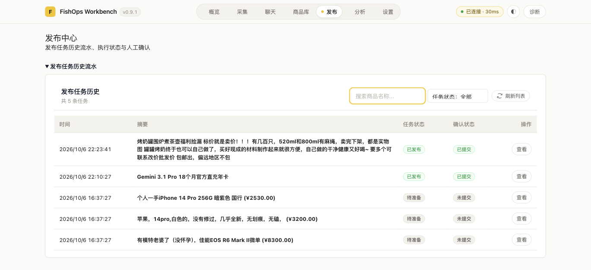
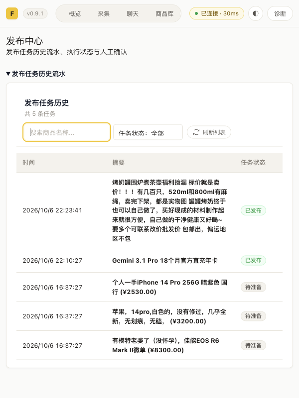

# Issue #23 发布历史验收

关联：https://github.com/a1667834841/FishOps/issues/23

工作区：`/Users/wuwenjing/orca/workspaces/FishOps-Workbench/bug`。分支：`fix/issue-23-publish-history`。

## 改动与数据契约

- 直接发布审计新增可选 `productName`。两阶段提交使用用户核对后的实际描述首行，最多 120 字；兼容旧账本，不保存完整草稿、地址或图片。闲鱼发布接口没有独立标题，忽略来源的旧 `title` 字段。
- 缺少名称快照的已发布旧审计按真实结果 `itemId` 只读查询商品描述。查询失败显示「商品名称暂不可用」，不猜测名称；刷新会重新查询，旧账本不做批量迁移。
- 相同幂等键只显示一行，最新审计更新名称、状态和结果链接。
- 旧任务发布成功时使用 `result.submit.publishedItemId`；已经提交但缺少可信结果 ID 时禁用「查看」。未提交旧任务使用其真实来源商品 ID。仅数字商品 ID 可生成闲鱼详情地址。
- 删除流水来源小字及素材选择整个专区。保留商品库行的发布入口、草稿弹窗和关闭后的「核对当前商品」入口。
- 时间禁止换行，窄屏表格内部横向滚动。

## 检查记录

检查工作目录均为当前工作区；运行记录保存在本机 `/tmp/issue23-*.log`。

| 检查 | 结果 |
| --- | --- |
| 修复前定向历史回归 | 3 个新增场景失败：名称、商品链接和缺失名称；失败可解释原问题 |
| `npm run test --workspace @fishops/workbench` | 400/400 通过 |
| `npm run test:publish` | 282/282 通过，全部使用 Mock，不执行真实发布 |
| 最后补齐测试类型后的历史定向回归 | 8/8 通过 |
| 共享包、扩展包 typecheck；最终工作台 typecheck | 全部退出码 0 |
| `npm run agent:setup` | 退出码 0；实际构建、同步固定目录、重载与配置导入，含 `SETUP_COMPLETED` |
| `npm run test:security` | 41 通过，0 失败 |
| `git diff --check` | 退出码 0 |

初次类型检查因工作区未安装依赖失败，执行 `npm ci` 后继续。修改后的类型检查发现旧一步式来源联合类型及新增测试缺少任务字段，均已修正。旧布局/生命周期测试原先要求保留素材专区，已按新需求更新；隐私回归更新为只允许名称摘要，仍禁止地址和完整草稿落盘。没有未解释的失败。

## 真实环境验收

日期：2026-10-06。真实入口为固定测试扩展 `lnkgjbkfdimiloglccfmeefcclfgifbo/workbench.html`。`agent:setup` 来源为当前工作区；部署前概览显示运行中任务为 0。

1. 修改前真实流水有 4 条：1 条直接发布审计摘要及操作显示 ID，3 条待准备旧任务；素材专区可见。
2. 部署后旧审计只读补齐名称「Gemini 3.1 Pro 18个月官方直充年卡」。流水来源小字和素材专区消失，4 行均显示「查看」。
3. 用户明确授权当前测试账号真实发布商品后，从「商品库 → 自己发布的商品库」选择烤奶罐原商品 `1089210177108`，进入发布核对弹窗。关闭再通过「核对当前商品」打开成功，保留原描述、售价 4.50 元及真实图片。
4. 点击一次「确认并发布」，平台返回新商品 `1087722907130`。流水增加至 5 条，名称显示实际提交描述的首行摘要；倒计时后返回历史。
5. 浏览器刷新会回到概览，再进入发布页：新记录名称仍保留。搜索「烤奶罐」并筛选「已发布」得到 1 条，链接为新商品而非来源商品；清空筛选后恢复 5 条，按时间倒序。
6. 点击新记录「查看」打开真实闲鱼详情页，URL 为 `https://www.goofish.com/item?id=1087722907130`，商品图片、描述及售价与提交一致。ego 的语义点击对该链接报元素断开，坐标点击未产生弹窗；最终通过页面 DOM 的原生 `click()` 触发现有链接，未改写链接或注入业务数据。
7. 600px 视口下页面宽度为 600px，表格容器宽 534px、内容宽 760px，表格内部横向滚动；5 行时间均为 `white-space: nowrap`。

真实数据没有缺失链接、名称查询失败或未知发布结果；这些边界由定向单测覆盖。没有追加发布、发送消息、下架或删除。新测试商品保留在账号中，未自动清理。

## 最终代码截图

流水与窄屏图来自真实扩展。商品详情截图裁掉顶部账号区域，仅保留真实商品图、价格及描述；原商品图片自带水印未更改。不包含配置、token 或密钥。

本地检查通过不代表 CI 已通过；PR 交付后等待人工 Review，不自动合并。
