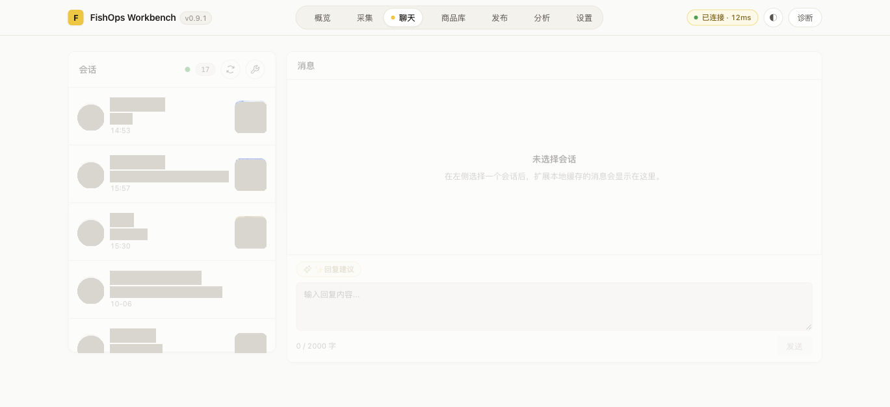
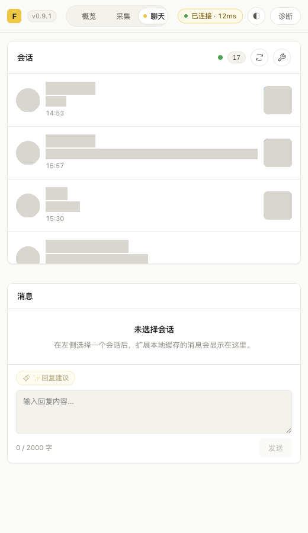

# Issue #42：会话身份与商品封面

## 调查与实施计划

- 工作区：`feature`；分支：`a1667834841/feature`。复用已关联 #42 的独立工作区。
- 分级：D（跨包会话契约与 session 存储）。新增可选字段，旧缓存无需迁移；回退可重新部署旧版本，不改平台商品或聊天正文。
- 2026-10-07 在 ego-browser 空间 327 从真实 `https://www.goofish.com/im` 入口，调用已有只读 `mtop.taobao.idlemessage.pc.session.sync` v3.0，参数 `sessionTypes:[1], fetchNum:30`，返回成功。
- 脱敏证据：30 个会话均带 `session.itemInfo.{itemId:number, mainPic:string, sellerInfo:object}`；封面为 `https://img.alicdn.com` URL。双方资料位于 `session.ownerInfo` / `session.userInfo`，含 `userId`、`fishNick`、`nick`、`logo`。不记录真实 ID、昵称、聊天正文或完整图片 URL。
- 后续真实复验发现，当前 LWP 返回 17 个会话，批量 `session.sync` 的条目与它们未匹配。官方页面会话行的 React 数据中，9 / 10 个可见条目与 LWP ID 精确匹配，8 个带商品封面；不能按昵称将其它批量条目强行对应。
- 观察官方页面正常选择会话，实际读取 `mtop.idle.trade.pc.message.headinfo` v1.0，参数为 `itemId`、`sessionId`、`sessionType:1`。响应包含 `data.commonData.itemId:number` 与 `data.left.data.picUrl:string`。实现将该只读接口作为商品封面回退，先核对返回商品 ID，再绑定会话。
- `user.query` 的真实 `logo` 包含 HTTP 阿里 CDN URL。仅将 `.alicdn.com` 的 HTTP 地址升级为 HTTPS，仍拒绝凭据 URL 和其它 HTTP 地址。不放宽消息图片的校验。
- 复用资料解析器，将商品 ID 与封面按 `sessionId` 一起补齐；来源仅为该会话 `itemInfo.mainPic` 或经 ID 核对的官方商品头信息，不读取聊天图片。批量身份无法确认时跳过，昵称与头像按会话作用域查询回退。
- 扩展会话模型新增可选 `itemCoverUrl`，通过现有 store、session 存储与 Bridge 传到工作台。商品关联变化时清除旧封面；重复同步保留可信买家资料。记录会话缓存所属账号，列表不展示旧账号或归属未知的缓存；账号变化后丢弃旧在途响应。新同步自动重建旧缓存归属，无需手工迁移。
- 会话行：40px 圆形头像、昵称 / 单行摘要 / 时间、48px 圆角封面；头像右上角显示未读数。按钮保留键盘焦点与选择行为，缺图或加载失败显示占位，无商品不占封面位置。

## 验收计划

1. 同步 → 会话就绪 → 昵称、头像与独立商品封面可见 → 只读请求，不发送消息。
2. 最近消息由卖家发出、再次同步 → 买家身份保留 → 顶部与列表一致 → 不覆盖成卖家资料。
3. 同一买家多会话、商品关联变化 → 按 sessionId 分开映射 → 不串图 → 旧封面清除。
4. 缺失字段、非法 URL、加载失败、通知类会话 → 稳定占位或无商品 → 可选择 → 不显示破图。
5. 窄窗口、长昵称摘要、多未读 → 布局不重叠 → 键盘可聚焦选择 → 不阻塞同步及历史读取。
6. 定向测试、完整回归、真实部署与脱敏截图。未经额外授权不发送真实消息；现有回复流程以回归测试验证。

## 最终真实验收

2026-10-07，在用户允许新建的 ego-browser 空间 329 验收。空间 327 被完整回归脚本关闭并删除，不能恢复；已向用户说明技能约束并取得新建授权。固定插件来源为本工作区，`agent:setup` 输出 `SETUP_COMPLETED`，刷新实际 `/im` 宿主并重新打开工作台。

| 动作 | 状态与可见结果 | 副作用及边界 |
| --- | --- | --- |
| 打开聊天页并同步 | 17 个会话，17 个真实头像、15 个关联商品封面，2 个无商品会话不显示封面 | 只读资料请求，无真实发送 |
| 对照官方闲鱼可见会话行 | 8 个商品会话的 sessionId / itemId / 封面逐项一致（8 / 8） | 内存比较后仅记录数量，不导出真实 ID 或 URL |
| 再次点击同步最近平台记录 | 昵称、头像及封面序列保持一致 | 保留选择与历史流程；平台可能正常更新会话排序 |
| 用 Enter 选择会话，再连续切换 | 选中态正常，顶部昵称与头像和对应会话行一致 | 按现有选择流程执行已读确认，不发送消息 |
| 同步选中会话的历史 | 2 条真实消息显示，同步无错误，选择保持 | 历史只读；回复建议与发送按钮入口保留，未点击发送 |
| 检查同一买家多商品 | 存在 1 组买家对应多个商品，各会话共有 2 个不同封面 | 按 sessionId 与商品 ID 区分，不按昵称合并 |
| 桌面布局 | 1369 × 627 窗口；会话列 320px，行高 88px，头像 40px、封面 48px | 未选择会话时显示选择提示 |
| 窄窗口 | 520px 与 390px 下，文档宽度分别为 520px、390px；头像、文字及商品不重叠 | 会话列表自身滚动；按钮可键盘聚焦并选择 |

### 验证边界

- 当前真实缓存没有最近消息方向为 `out` 的会话；卖家消息不覆盖买家身份由解析、重复同步及回复接线回归覆盖，没有为验收发送真实消息。
- 未切换第二个真实账号，未等待自然实时新消息；账号归属过滤、旧在途响应丢弃和实时摘要 / 未读状态由定向回归覆盖。
- 真实数据的 15 个商品封面均加载成功。缺失、非法 URL、加载失败占位和长文本 / 多未读属于代码与回归验证边界，未伪造真实页面状态。
- 昵称使用平台提供的 `fishNick` / `nick`。平台隐藏的资料保持原值，不尝试推测完整昵称。

### 脱敏截图

以下图片来自最终实际部署和真实会话；昵称、消息摘要、头像及商品图片已遮盖，保留原位置、尺寸、圆角与时间。未替换业务内容。原始截图只保存在本机 `/tmp`，不提交。

## 本地检查记录

- 初始验收断言失败：旧实现未返回关联商品 ID / 封面。修改后聊天定向测试 336 项通过，新增覆盖字段来源、同买家多商品、非法图片、商品变更、旧缓存恢复、账号隔离及在途响应。
- 最终完整回归：`FISHOPS_REGRESSION_SPACE_ID=329 npm run regression:full`，根目录为本工作区，退出码 0。报告为 `.regression/2026-10-07T08-27-16-158Z-27144/report.json`，`ok:true`；单测、类型检查、构建、安全、Bridge 冒烟、采集冒烟、Service Worker 启动及全部真实 E2E 用例通过。
- 完整回归在基线提交 `6288eaa` 加当前未提交源码上执行，报告 `dirty:true`；产物部署来源核对通过。
- 前端列表再次读取时，若选中会话被账号过滤或相同 sessionId 的所属账号变化，清空旧选择、消息与分页在途代；补充控制器回归，防止顶部沿用旧身份。
- CI 尚未运行；提交 PR 后由 CI 执行本地检查。真实账号切换、自然实时新消息、最近消息为卖家发出的真实截图仍属于未覆盖边界。
- 最后补充前端清理后再次运行 `npm run regression`：退出码 0，报告 `.regression/2026-10-07T08-30-07-942Z-33845/report.json`，全量单测、类型、构建及产物检查全部通过。
- 用户授权的新空间 330 中重新执行 `agent:setup` 并更新两张最终截图；再次验证 17 个会话、15 个商品封面及键盘选择后的顶部身份一致性。随后重跑真实 E2E；该空间在脚本成功结束时关闭。
- 最终真实 E2E 命令：`FISHOPS_REGRESSION_SPACE_ID=330 npm run regression:e2e`，退出码 0，报告 `.regression/2026-10-07T08-31-10-568Z-38154/report.json`。13 个真实用例全部通过，空间已关闭。
