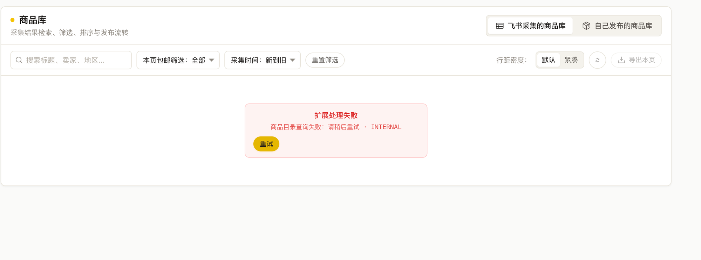

# Issue 正文：商品库空结果与未配置飞书的提示

- 目标仓库：a1667834841/FishOps
- 状态：已创建 issue #2（OPEN，label: bug）
- 截图：已上传 `docs/images/issue-2-product-library-empty-state.png`（commit 4644733），并嵌入 issue #2 正文「实际结果」章节
- 标题：`[Bug] 商品库：查询无结果或未配置飞书时应显示对应提示`
- 分类：bug（用户明确指定，仓库已存在同名 label）
- 链接：https://github.com/a1667834841/FishOps/issues/2
- 提交历史：曾尝试创建并返回 403（当时 token 无写权限，勿在原 403 路径重复重试）。本次提交前复核 `gh api repos/a1667834841/FishOps` 返回 `permissions: {admin: true, maintain: true, push: true, triage: true}`，写权限已具备；`gh issue list --state all` 仅有一条无关 issue #1“乱码”，无重复项，故提交一次并成功。

---

## 问题概述

商品库查询不到结果，或未配置飞书时，页面给出笼统异常提示，用户无法判断是“没有数据”“尚未配置”还是“系统故障”。应针对不同情况给出对应提示。

## 环境信息

- 版本：待确认
- 运行环境（OS / 浏览器）：待确认
- 相关配置（飞书配置状态、数据源）：待确认
- 数据内容 / 规模：待确认
- 复现频率：待确认

## 复现步骤

1. 打开商品库页。
2. 分别处于以下状态：查询条件无匹配结果；飞书未配置；真实系统故障。
3. 观察页面提示内容。

## 实际结果

- 用户报告：商品库查询不到时给出的提示笼统，未区分“无结果”与“未配置飞书”；用户已提供截图附件；本轮未能读取截图内容，具体文案未重新核验。
- 历史记录（早期截图，仅供背景，本轮未重新核验）：页面出现红色错误块“扩展处理失败”，详情“商品目录查询失败：请稍后重试 · INTERNAL”，带“重试”按钮；状态区显示扩展“已连接 · 84ms”。
- 用户截图（2026-10-05 归档到仓库）：

  

## 预期结果

- 查询无结果时：显示数量 0 的正常空状态，不显示错误提示。
- 未配置飞书时：明确说明“未配置飞书”，并提供前往设置的入口。
- 真实系统故障时：保留准确错误提示，不把故障吞成空列表。

## 证据与排查状态

- 证据：本轮对话文本及截图附件；截图已归档到仓库 `docs/images/issue-2-product-library-empty-state.png`（见上文“实际结果”），上传时未读取截图内容，具体文案未重新核验；早期截图文本（历史记录，本轮不重新核验）。
- 已证实：待确认。
- 排查状态：待排查。
- 推测（待验证）：空结果或未配置可能被统一映射为内部错误，从而只给出笼统提示。此为推测，非已证实根因。

## 影响范围

- 已知：商品库页的查询提示。
- 待排查：其他数据来源与页签是否同样受影响。
- 范围外：登录相关需求不在本次范围内。

## 验收标准

- [ ] 查询无结果时，数量显示 0 并呈现正常空状态，无错误提示。
- [ ] 未配置飞书时，明确提示未配置，并提供前往设置的入口。
- [ ] 真实系统故障时，保留准确错误提示，不被吞成空列表。
- [ ] 已配置且有数据时，正常显示商品列表与数量。
