# P5 聊天只读层（接线说明）

只读地监听闲鱼聊天 WebSocket、拉取历史、并把标准 `ChatMessage` / `Conversation` 交给 Workbench。
**不发送任何聊天消息、不启用自动回复、不调用 AI**（发送属 P6）。

## 链路



```mermaid
flowchart TD
    WS[闲鱼页面 WebSocket] -->|只读监听| MON[chat-main.ts / installChatWebSocketMonitor]
    MON --> HOST[chat-host.ts]
    HOST -->|实时原文 CHAT_SOCKET_EVENT| ISO[isolated-bridge.ts]
    ISO -->|chrome.runtime.sendMessage| BG[background/index.ts]
    BG -->|来源+负载校验| RT[chat-runtime.ts]
    RT --> STORE[(ChatStore / storage.session)]
    RT -->|drainEvents| BC[P1 broadcast]
    BC --> WB[Workbench RuntimeClient.on]
    WB -->|CHAT_* 命令| RT
    BG -.->|chrome.scripting MAIN| HOST
    HOST -->|只读 LWP /r/Conversation| WS
    HOST -->|只读 LWP /r/MessageManager| WS
```

- **MAIN world**：`content/chat-main.ts`（`document_start`，manifest `world: "MAIN"`）
  - 安装 `installChatWebSocketMonitor`（只读，不 send、不改页面行为）；
  - 原始消息 / 连接状态经 P1 postMessage bridge 以 `CHAT_SOCKET_EVENT` 上报；
  - 只读 LWP transport 挂在 `window.__FISHOPS_CHAT_TRANSPORT__`。
- **background**：`chat-runtime.ts` 组装 `ChatStore` + `ChatHistoryClient` + `ChatSync` + `ChatBridgeAdapter`；
  `message-router.ts` 把 Workbench 的 `CHAT_*` 命令委托给 `ChatRouterDeps`。

## 命令 / 事件

| 命令 | 说明 |
|---|---|
| `CHAT_STATUS` | socket 状态 + 会话/消息计数 |
| `CHAT_LIST_CONVERSATIONS` | 列出本地缓存会话 |
| `CHAT_GET_MESSAGES` | 读取某会话本地缓存消息 |
| `CHAT_SYNC_HISTORY` | 只读 LWP 拉取某会话历史 |
| `CHAT_SYNC_CONVERSATIONS` | 只读 LWP 拉取会话列表 |
| `CHAT_SOCKET_EVENT` | **仅** goofish content script 上报的原始 socket 事件 |

| 事件 | 说明 |
|---|---|
| `CHAT_MESSAGE_INGESTED` | 实时消息入库（仅元数据） |
| `CHAT_CONVERSATION_UPDATED` | 会话更新（仅计数） |
| `CHAT_SYNC_COMPLETED` | 历史/会话同步完成 |
| `CHAT_SOCKET_STATUS` | WebSocket 连接状态变化 |

命名与校验统一登记在 `shared/events`（`commands.ts` / `events.ts` / `codec.ts`）。

## 安全边界

- **只读 transport 白名单**：仅允许 `/r/Conversation/listNewestPagination`、`/r/MessageManager/listUserMessages`
  两条路由；LWP 信封只允许 `lwp` / `headers.mid` / `body` 三个字段，多余字段一律拒绝；超时 15s，按 `headers.mid` 关联响应。
- **来源校验**：`CHAT_SOCKET_EVENT` 只接受本扩展 + goofish content script 来源（`chat-source.ts`）。
- **负载限制**：原始帧超过 `CHAT_SOCKET_MAX_RAW_LENGTH`（256 KiB）拒绝/丢弃。
- **不泄露正文**：事件负载只含元数据；不打印聊天正文；持久化字段白名单，不存 raw / base64 / cookie / token。

## 持久化策略

`SessionChatPersistence` 存 `chrome.storage.session`（会话内有效、浏览器关闭清空），
按 `maxMessages=500` / `maxConversations=100` 截断，写入前字段白名单。
若正文量级超出 session 配额，可实现同一 `ChatPersistence` 接口切换到 IndexedDB，上层无感。

## 测试

```bash
cd extension
node --import ./src/chat/test/register.mjs --test src/chat/test/
```

覆盖：parser / store / sync / history / websocket（原有），以及
socket-transport（白名单 / mid 关联 / 超时）、background-transport（mock executor）、
chat-host（只读监听 / LWP 消化）、chat-routing（命令路由 / 来源校验 / PING 回归）、
session-persistence（去重 / 白名单 / 上限）。

---

# P6 聊天发送与 AI（后台逻辑，无 UI）

在 P5 只读层之上新增「显式发送 + 回复规则引擎 + AI」的后台能力。
**默认 `suggest`（建议 / 人工安全）模式，绝不自动发送。** 本轮不做 Workbench UI。

## 链路

```mermaid
flowchart TD
    WB[Workbench RuntimeClient] -->|P6 命令| BG[background/index.ts]
    BG -->|P6 路由| RT[reply-runtime.ts]
    RT --> ENG[reply-engine.ts + reply-safety.ts]
    RT --> CFG[reply-config(-chrome).ts]
    RT --> AI[ai-service.ts]
    RT --> SENDER[ChatMessageSender]
    SENDER -->|独立白名单| SBG[send-background.ts] -->|chrome.scripting MAIN| SHOST[send-host.ts]
    SHOST -->|/r/MessageSend/sendByReceiverScope| WS[闲鱼聊天 WebSocket]
    RT -.->|只读复用| P5[P5 ChatRuntime / store]
```

## 文件与职责

| 文件 | 职责 |
|---|---|
| `extension/src/chat/send-protocol.ts` | 纯协议：mid/uuid、base64 文本编码、发送信封构造与**独立**白名单校验 |
| `extension/src/chat/send-transport.ts` | `ChatSendSocketTransport`：按 mid 关联响应、10s 超时、结构化错误（**不改** P5 只读白名单） |
| `extension/src/chat/send-client.ts` | `ChatMessageSender`：发送前校验 sessionId/receiverId/myId/content |
| `extension/src/chat/send-host.ts` | MAIN world 发送 host（`window.__FISHOPS_CHAT_SEND__`） |
| `extension/src/chat/send-background.ts` | background 经 `chrome.scripting` 调用发送 host |
| `extension/src/chat/reply-engine.ts` | 规则引擎：优先级、正则 `i`、商品绑定、cooldown、delay、黑名单、防重、会话冷却、自己消息过滤、AI 暂停 |
| `extension/src/chat/reply-safety.ts` | 自动回复安全闸：全局开关、转人工关键词、每会话频率上限 |
| `extension/src/chat/reply-config.ts` | `ReplyConfigStore` 抽象 + memory / mock 实现（规则与全局分开） |
| `extension/src/chat/reply-config-chrome.ts` | `chrome.storage.local` 适配器（凭据隔离键，规则落库前字段白名单净化） |
| `extension/src/chat/ai-service.ts` | OpenAI 兼容补全：超时 / 取消 / 非 2xx / 非法响应结构化；视觉仅保留接口 |
| `extension/src/chat/ai-prompt.ts` | 纯函数：把历史 + 当前消息 + 商品详情拼成 AI messages |
| `extension/src/background/reply-runtime.ts` | P6 运行时组装与命令处理 |
| `shared/types/reply.ts`、`shared/reply/**` | P6 共享类型与运行时校验 / 净化 |

## 命令 / 事件

| 命令 | 说明 |
|---|---|
| `CHAT_SEND_MESSAGE` | 显式发送一条文本消息（唯一手工发送入口） |
| `CHAT_GET_REPLY_SUGGESTION` | 生成回复建议（关键词或 AI），**不发送**；独立于自动回复总开关；无规则且已配 AI 时回退默认 AI 建议 |
| `CHAT_APPLY_REPLY` | 采用（或修改后）建议并发送 |
| `CHAT_AUTO_REPLY_STATUS` | 查询开关 / 模式 / 暂停 / 计数（不含凭据） |
| `CHAT_RULES_GET` / `CHAT_RULES_SET` | 读取 / 写入规则与全局配置（规则整表 + 全局增量） |
| `CHAT_AI_PAUSE_SET` | 手动暂停 / 恢复 AI 自动回复 |

| 事件 | 说明 |
|---|---|
| `CHAT_MESSAGE_SENT` | 发送完成（仅元数据，不含正文） |
| `CHAT_AUTO_REPLY_TRIGGERED` | 自动回复已触发（规则 / 会话元数据） |
| `CHAT_AI_PAUSE_CHANGED` | AI 暂停状态变化 |
| `CHAT_RULES_UPDATED` | 规则 / 全局配置已更新 |

## 安全边界

- **显式发送**：只有 `CHAT_SEND_MESSAGE` / `CHAT_APPLY_REPLY` 会真正发送；建议与自动回复都以“先判定再发送”为原则。
- **P5 只读白名单不放宽**：发送走 `send-transport.ts` 的独立白名单（仅 `/r/MessageSend/sendByReceiverScope`）；
   P5 `ChatSocketTransport` 仍会拒绝发送路由（有单测固定）。
- **默认建议模式**：`DEFAULT_REPLY_GLOBAL_CONFIG.enabled=false`、`mode='suggest'`；`auto` 模式下还会经过安全闸。
- **手动建议独立于总开关**：`CHAT_GET_REPLY_SUGGESTION` 是用户显式动作，`enabled=false` 时仍可生成；它**不发送**、**不消费自动回复配额**（不调用 `commit`）。无规则命中且已配置 AI 时，回退为携带上下文与图片的默认 AI 建议。
- **凭据隔离**：API key 只在 `chrome.storage.local` 的独立键由配置适配器读取，不进规则 / 日志 / 事件；
  规则里出现 `apiKey` / `token` 等字段会被运行时校验直接拒绝，落库前另有字段白名单净化。
- **不带正文**：事件负载只含元数据；AI / 发送错误信息不含消息正文。
- **测试不触网**：所有单测使用假 socket / 假 fetch，绝不发送真实消息、绝不调用真实 AI。

## 测试

```bash
cd extension
node --import ./src/chat/test/register.mjs --test src/chat/test/
```

P6 新增：`send-protocol` / `send-transport` / `send-client` / `reply-engine` / `reply-safety` /
`reply-config` / `ai-service` / `reply-runtime`（含 `message-router` P6 路由）。

## 本轮未做（UI 与接线后续项）

- **Workbench UI**：建议面板、规则编辑、状态开关等界面（按要求本轮不做）。
- **MAIN world 发送 host 的加载**：`send-host.ts` 已实现并可安装，但接入 `content/chat-main.ts` /
  manifest 入口会改到 P5/P1 文件，本轮未动；未接线时发送返回结构化 `NO_SOCKET`。
- **实时消息 → 自动回复的触发接线**：`ReplyRuntime.handleIncomingMessage` 已实现且有测试，
  但把它挂到 P5 实时 ingest 需要改动 P5 `chat-runtime`，本轮未动。
- **商品详情拼接**：`buildAiMessages` 支持 `itemDetail`，但尚未接入平台层商品接口。
- **视觉能力**：`AiChatService.analyzeImage` 仅保留接口，返回 `UNSUPPORTED`，不调用真实网络。
